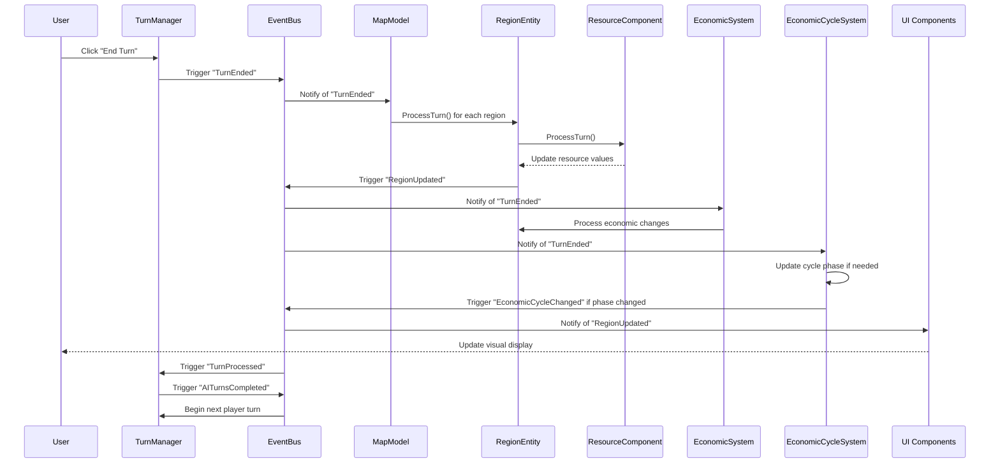
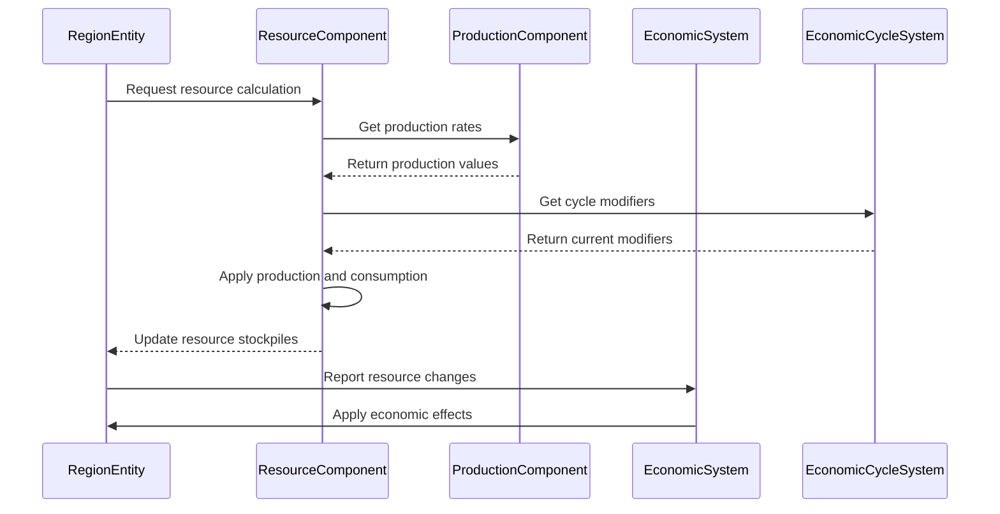
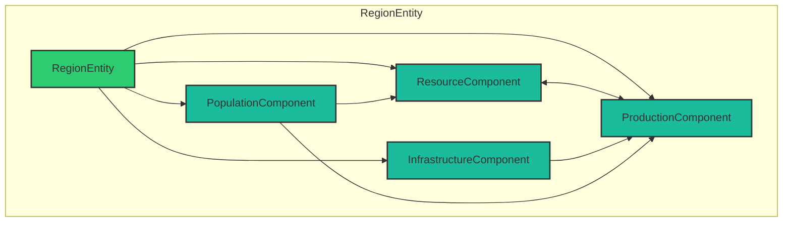
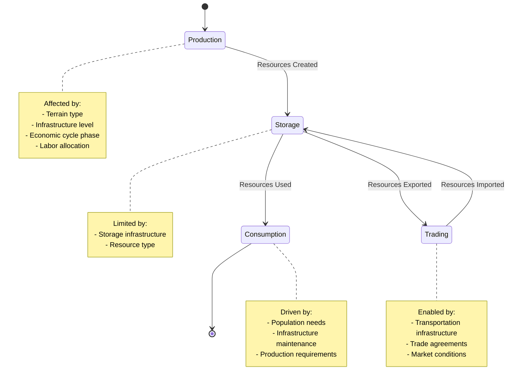
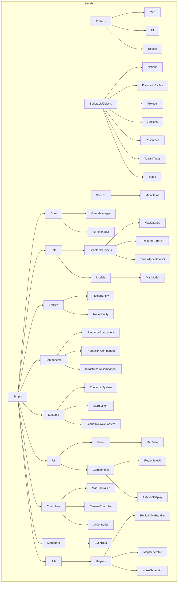
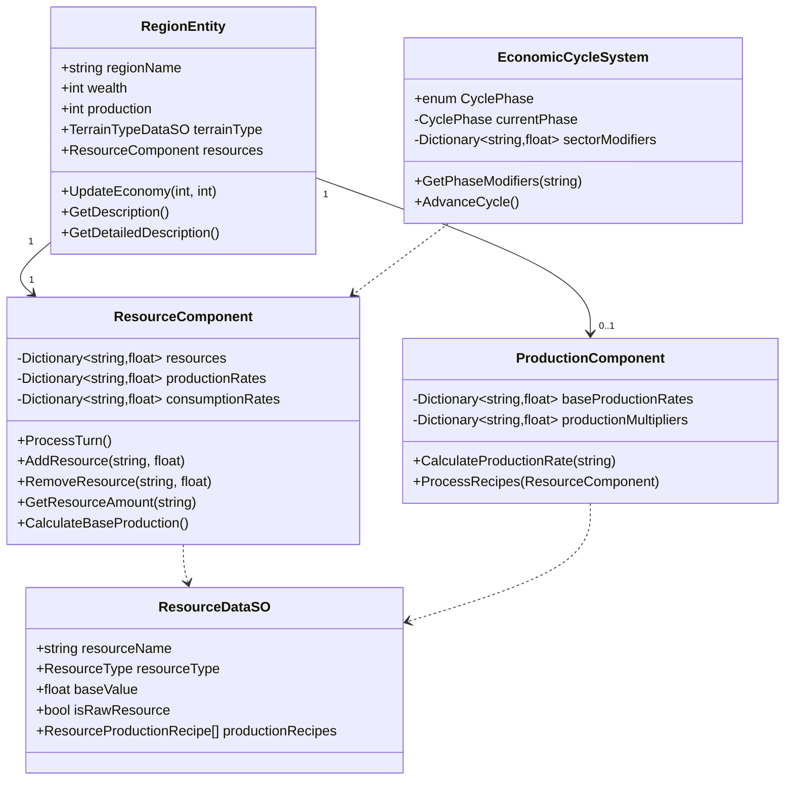

# Economic Cycles: Updated Architecture Diagram

## Core Architecture

```mermaid
graph TD
    %% Core Managers
    subgraph "Core Managers"
        GM[GameManager]
        TM[TurnManager]
        EM[EventBus]
    end

    %% Data Layer
    subgraph "Data Layer"
        SO[ScriptableObjects]
        subgraph "Models"
            MM[MapModel]
            ECM[EconomicCycleModel]
        end
    end

    %% Entities
    subgraph "Entities"
        RE[RegionEntity]
        NE[NationEntity]
        PE[ProjectEntity]
    end

    %% Components
    subgraph "Components"
        RC[ResourceComponent]
        PC[ProductionComponent]
        IC[InfrastructureComponent]
        POPC[PopulationComponent]
    end

    %% Systems
    subgraph "Systems"
        ECS[EconomicSystem]
        MS[MapSystem]
        PS[ProjectSystem]
        RTS[ResourceTradeSystem]
        ECS2[EconomicCycleSystem]
    end

    %% UI
    subgraph "User Interface"
        subgraph "Views"
            MV[MapView]
            RV[RegionView]
            EV[EconomicView]
            RDV[ResourceDashboardView]
        end
        subgraph "UI Components"
            RP[RegionPanel]
            RIU[RegionInfoUI]
            ED[EconomicDashboard]
            AAD[AIActionDisplay]
        end
    end

    %% Controllers
    subgraph "Controllers"
        MC[MapController]
        CC[CameraController]
        PC2[ProjectController]
        AIC[AIController]
    end

    %% Utils
    subgraph "Utilities"
        MG[MapGenerator]
        RCH[RegionClickHandler]
        NG[NoiseGenerator]
        TG[TerrainGenerator]
    end

    %% Major Relationships
    GM --> MM
    GM --> TM
    MM --> RE
    MM --> NE
    MM -.-> EM
    RE --> RC
    RE --> PC
    RE --> IC
    RE --> POPC
    
    MV --> SO
    MC -.-> EM
    MC --> GM
    
    MS -.-> EM
    MS --> MV
    
    ECS -.-> EM
    ECS --> RE
    ECS --> RC
    
    TM -.-> EM
    
    RCH -.-> EM
    
    EM -.-> MS
    EM -.-> ECS
    EM -.-> RIU
    EM -.-> MV
    EM -.-> ECS2
    
    RIU --> RE
    RIU --> RC
    
    NE --> RE
    
    ECS2 --> RC
    ECS2 --> PC
    
    AIC -.-> EM
    AIC --> AAD
    
    %% Resource System Connections
    RC --> RTS
    RC --> ECS
    ECS2 --> RC
    
    %% Legend
    classDef core fill:#ff9900,stroke:#333,stroke-width:2px
    classDef data fill:#3498db,stroke:#333,stroke-width:2px
    classDef entities fill:#2ecc71,stroke:#333,stroke-width:2px
    classDef components fill:#1abc9c,stroke:#333,stroke-width:2px
    classDef systems fill:#9b59b6,stroke:#333,stroke-width:2px
    classDef ui fill:#e74c3c,stroke:#333,stroke-width:2px
    classDef controllers fill:#f1c40f,stroke:#333,stroke-width:2px
    classDef events fill:#34495e,stroke:#333,stroke-width:2px
    classDef utils fill:#95a5a6,stroke:#333,stroke-width:2px
    
    class GM,TM,EM core
    class SO,MM,ECM data
    class RE,NE,PE entities
    class RC,PC,IC,POPC components
    class ECS,MS,PS,RTS,ECS2 systems
    class MV,RV,EV,RDV,RP,RIU,ED,AAD ui
    class MC,CC,PC2,AIC controllers
    class MG,RCH,NG,TG utils
```

## Data Flow - Turn Processing

## Resource System Flow

## Components Relationship

## Resource State Transitions

## Folder Structure (Updated)

## Implementation Status

| Component | Status | Description |
|-----------|--------|-------------|
| Core Managers | Implemented | GameManager, TurnManager, EventBus |
| Map Generation | Implemented | Terrain and nation procedural generation |
| Region Management | Implemented | Basic region functionality with terrain |
| Resource System | In Progress | Basic resource tracking, needs production chains |
| Economic Cycles | Planned | Framework ready, implementation pending |
| Production Chains | Planned | Basic structure defined, needs implementation |
| AI Nations | Initial | Basic AI turns with placeholder actions |
| UI Elements | Partial | Map view and region info implemented, resource dashboard needed |

## Resource System Design

## Next Implementation Priorities

1. Complete ResourceComponent integration
2. Implement basic ProductionComponent
3. Create EconomicCycleSystem with phase-based modifiers
4. Enhance UI to display resources and production chains
5. Develop region specialization mechanics
