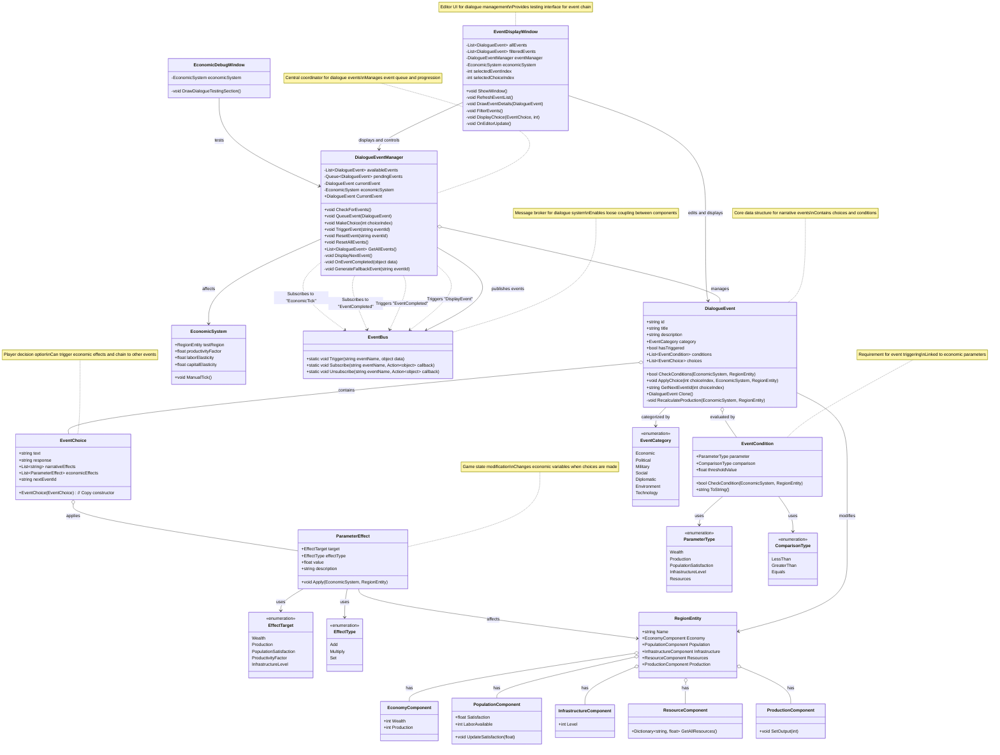

```mermaid
classDiagram
    %% Main Dialogue System Classes
    class DialogueEventManager {
        -List~DialogueEvent~ availableEvents
        -Queue~DialogueEvent~ pendingEvents
        -DialogueEvent currentEvent
        -EconomicSystem economicSystem
        +DialogueEvent CurrentEvent
        +void CheckForEvents()
        +void QueueEvent(DialogueEvent)
        +void MakeChoice(int choiceIndex)
        +void TriggerEvent(string eventId)
        +void ResetEvent(string eventId)
        +void ResetAllEvents()
        +List~DialogueEvent~ GetAllEvents()
        -void DisplayNextEvent()
        -void OnEventCompleted(object data)
        -void GenerateFallbackEvent(string eventId)
    }
    
    class DialogueEvent {
        +string id
        +string title
        +string description
        +EventCategory category
        +bool hasTriggered
        +List~EventCondition~ conditions
        +List~EventChoice~ choices
        +bool CheckConditions(EconomicSystem, RegionEntity)
        +void ApplyChoice(int choiceIndex, EconomicSystem, RegionEntity)
        +string GetNextEventId(int choiceIndex)
        +DialogueEvent Clone()
        -void RecalculateProduction(EconomicSystem, RegionEntity)
    }
    
    class EventChoice {
        +string text
        +string response
        +List~string~ narrativeEffects
        +List~ParameterEffect~ economicEffects
        +string nextEventId
        +EventChoice(EventChoice) // Copy constructor
    }
    
    class EventCondition {
        +ParameterType parameter
        +ComparisonType comparison
        +float thresholdValue
        +bool CheckCondition(EconomicSystem, RegionEntity)
        +string ToString()
    }
    
    class ParameterEffect {
        +EffectTarget target
        +EffectType effectType
        +float value
        +string description
        +void Apply(EconomicSystem, RegionEntity)
    }
    
    %% Enums
    class EventCategory {
        <<enumeration>>
        Economic
        Political
        Military
        Social
        Diplomatic
        Environment
        Technology
    }
    
    class ParameterType {
        <<enumeration>>
        Wealth
        Production
        PopulationSatisfaction
        InfrastructureLevel
        Resources
    }
    
    class ComparisonType {
        <<enumeration>>
        LessThan
        GreaterThan
        Equals
    }
    
    class EffectTarget {
        <<enumeration>>
        Wealth
        Production
        PopulationSatisfaction
        ProductivityFactor
        InfrastructureLevel
    }
    
    class EffectType {
        <<enumeration>>
        Add
        Multiply
        Set
    }
    
    %% Editor Interface
    class EventDisplayWindow {
        -List~DialogueEvent~ allEvents
        -List~DialogueEvent~ filteredEvents
        -DialogueEventManager eventManager
        -EconomicSystem economicSystem
        -int selectedEventIndex
        -int selectedChoiceIndex
        +void ShowWindow()
        -void RefreshEventList()
        -void DrawEventDetails(DialogueEvent)
        -void FilterEvents()
        -void DisplayChoice(EventChoice, int)
        -void OnEditorUpdate()
    }
    
    %% Economic System Classes
    class EconomicSystem {
        +RegionEntity testRegion
        +float productivityFactor
        +float laborElasticity
        +float capitalElasticity
        +void ManualTick()
    }
    
    class RegionEntity {
        +string Name
        +EconomyComponent Economy
        +PopulationComponent Population
        +InfrastructureComponent Infrastructure
        +ResourceComponent Resources
        +ProductionComponent Production
    }
    
    class EconomyComponent {
        +int Wealth
        +int Production
    }
    
    class PopulationComponent {
        +float Satisfaction
        +int LaborAvailable
        +void UpdateSatisfaction(float)
    }
    
    class InfrastructureComponent {
        +int Level
    }
    
    class ResourceComponent {
        +Dictionary~string, float~ GetAllResources()
    }
    
    class ProductionComponent {
        +void SetOutput(int)
    }
    
    %% Event System
    class EventBus {
        +static void Trigger(string eventName, object data)
        +static void Subscribe(string eventName, Action~object~ callback)
        +static void Unsubscribe(string eventName, Action~object~ callback)
    }
    
    %% Economic Debug Window
    class EconomicDebugWindow {
        -EconomicSystem economicSystem
        -void DrawDialogueTestingSection()
    }
    
    %% Relationships
    DialogueEventManager o-- DialogueEvent : manages
    DialogueEvent o-- EventChoice : contains
    DialogueEvent o-- EventCondition : evaluated by
    EventChoice o-- ParameterEffect : applies
    
    DialogueEventManager --> EconomicSystem : affects
    DialogueEventManager --> EventBus : publishes events
    
    DialogueEvent --> RegionEntity : modifies
    ParameterEffect --> RegionEntity : affects
    
    EventDisplayWindow --> DialogueEventManager : displays and controls
    EventDisplayWindow --> DialogueEvent : edits and displays
    
    EconomicDebugWindow --> DialogueEventManager : tests
    
    RegionEntity o-- EconomyComponent : has
    RegionEntity o-- PopulationComponent : has
    RegionEntity o-- InfrastructureComponent : has
    RegionEntity o-- ResourceComponent : has
    RegionEntity o-- ProductionComponent : has
    
    %% Event Flow Connections
    EventBus <.. DialogueEventManager : Subscribes to "EventCompleted"
    EventBus <.. DialogueEventManager : Subscribes to "EconomicTick"
    DialogueEventManager ..> EventBus : Triggers "DisplayEvent"
    DialogueEventManager ..> EventBus : Triggers "EventCompleted"
    
    %% Parameter enums relationships
    EventCondition --> ParameterType : uses
    EventCondition --> ComparisonType : uses
    ParameterEffect --> EffectTarget : uses
    ParameterEffect --> EffectType : uses
    DialogueEvent --> EventCategory : categorized by
    
    %% Add comments/notes
    note for DialogueEventManager "Central coordinator for dialogue events\nManages event queue and progression"
    note for DialogueEvent "Core data structure for narrative events\nContains choices and conditions"
    note for EventChoice "Player decision option\nCan trigger economic effects and chain to other events"
    note for EventCondition "Requirement for event triggering\nLinked to economic parameters"
    note for ParameterEffect "Game state modification\nChanges economic variables when choices are made"
    note for EventBus "Message broker for dialogue system\nEnables loose coupling between components"
    note for EventDisplayWindow "Editor UI for dialogue management\nProvides testing interface for event chain"
```