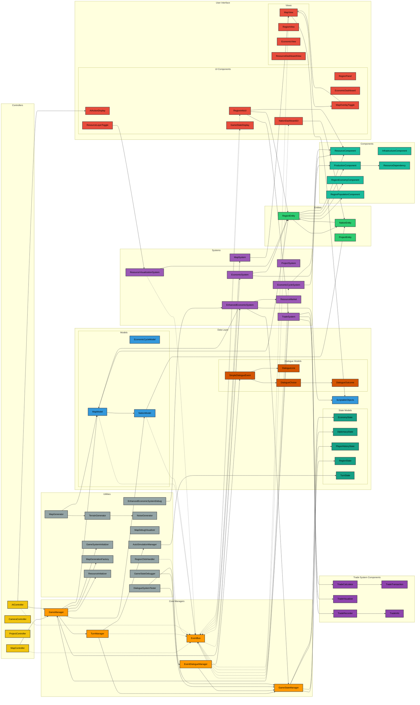
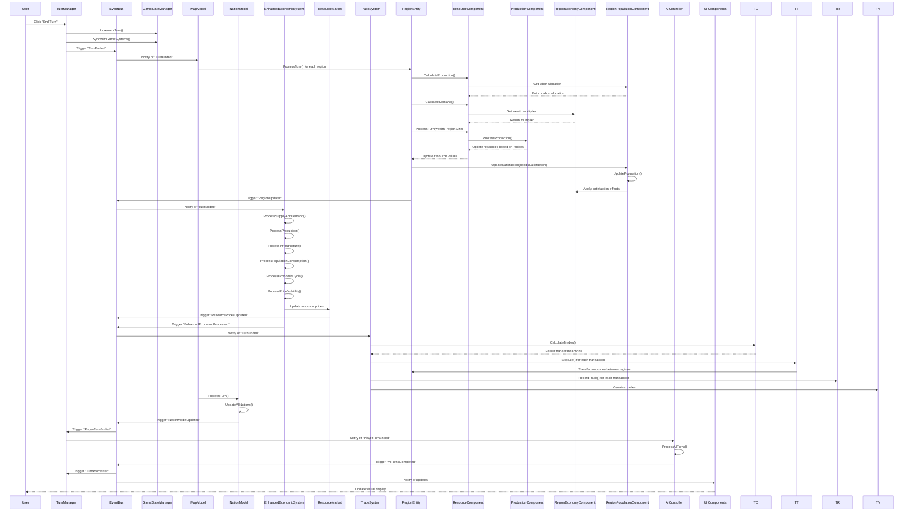
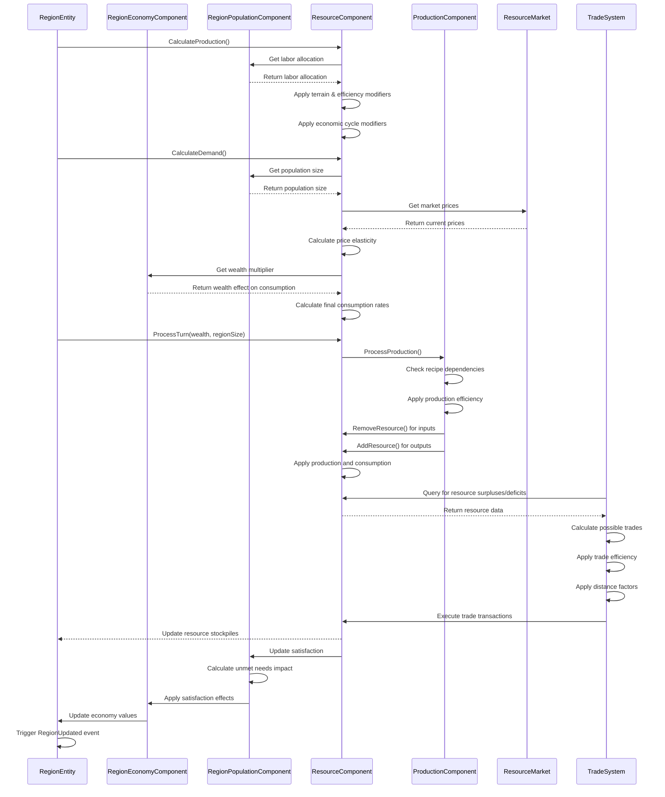
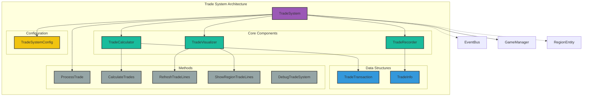
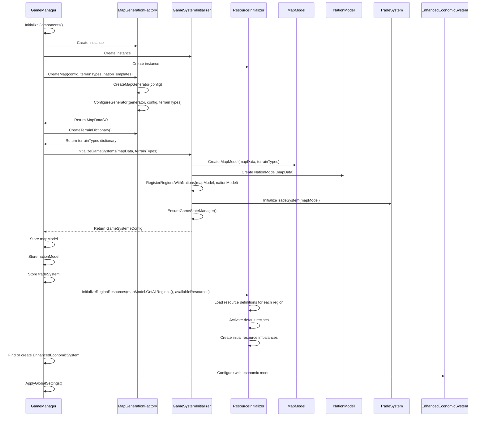

# 1. Game Design Document

## 1. Game Overview

- **Title**: Economic Cycles
- **Genre**: Roguelike Grand Strategy + Economic Simulator
- **Pitch**: A satirical economic strategy game where players guide a nation through booms, busts, and generational change in a world of absurd policies, trade rifts, and bureaucratic comedy.

## 2. Core Gameplay Loop

- **Turn Structure**: Strategic Assessment → Development Decisions → External Relations → End Turn Processing
- **Run Structure**: 30–40 year runs; generational shifts simulate longer-term change, affecting resources, infrastructure, and narrative state.
- **Meta-progression**: Unlocks new nations, policies, and conditions over multiple runs.

## 3. Inspirations & Influences

### Gameplay Influences
| Game                  | Influence                                               |
|-----------------------|---------------------------------------------------------|
| Crusader Kings        | Emergent storytelling, generational structure          |
| Europa Universalis IV | Regional simulation, production chains, trade nodes    |
| Slay the Spire        | Meta-progression and run-based structure               |
| Frostpunk             | Systems + story interplay, difficult trade-offs        |
| Dwarf Fortress        | Simulation depth, emergent chaos                       |
| FTL: Faster Than Light | Procedural run structure, branching node-based progression |

### Narrative & Thematic Influences
- Terry Pratchett (absurdism, wit, worldbuilding)
- Black Mirror (societal satire, system logic)
- Bureaucratic comedy (e.g., The Thick of It, Yes Minister)
- Historical satire and soft anachronisms

## 4. Core Features & Mechanics

### Summary Table
| Feature               | Description                                                                 |
|-----------------------|-----------------------------------------------------------------------------|
| Economic Cycles       | Boom → Peak → Recession → Recovery affecting gameplay conditions           |
| Generational Shifts   | Change in demographics, technology, and production after each run          |
| Infrastructure System | Region-based levels that boost output and enable projects                  |
| Policy Decisions      | Game-wide or regional decisions with trade-offs and cooldowns              |
| Event System          | Narrative and systemic events triggered by economic/political thresholds   |
| Production Chains     | Basic → Advanced resource refinement affecting outputs                     |
| Population Satisfaction | Driven by fulfillment of needs; affects productivity and unrest          |
| Meta-Progression      | Unlocks over multiple runs (nations, traits, techs)                        |

## 5. Major Game Systems

### 5.1 Economic System
- Sectors: Agriculture, Industry, Commerce, etc.
- Inputs/outputs, infrastructure multipliers, labor dependency
- Implements Cobb-Douglas production (Output = A × L^α × K^β)
- Economic cycles apply phase-based multipliers to wealth and production
- Price volatility introduces strategic unpredictability in supply-demand balancing

### 5.2 Resource System
- Primary (timber, food) and secondary (textiles, consumer goods)
- Regional surplus/shortage mechanics and interdependence
- Dynamic pricing based on supply/demand imbalance and elasticity
- Substitution logic via cross-price elasticity

### 5.3 Population System
- Labor availability, satisfaction, unrest
- Class dynamics and demographic shifts
- Wealth-based consumption modeling
- Unmet needs lower satisfaction and trigger unrest events

### 5.4 Infrastructure & Projects
- Level-based bonuses
- Enables regional specialization and unlocks
- Infrastructure boosts production efficiency
- Maintenance cost reduces wealth each turn

### 5.5 Event & Narrative System
- Triggered by cycles, policies, population status
- Ties back to tone and world state
- Supports conditional dialogue with player stats (e.g., Charisma, Intelligence)
- Implements modular narrative logic (intro → choice → consequence)
- Tracks event flags like “MediaScandalActive” for persistent outcomes

### 5.6 Diplomacy & Trade (Planned)
- Future expansion with routes and inter-nation strategy

## 6. Meta Systems & Replayability

- Generational transitions simulate legacy and systemic decay/progress
- Unlockable nations, ideologies, technologies
- Randomized events and world states ensure variation
- Thought Cabinet system:
  - Ideologies are discovered or chosen through events or conditions
  - Thoughts require incubation (delayed activation) and provide permanent buffs/debuffs
  - Ministers and factions react to ideological shifts
  - Conflicting ideologies block each other, shaping national doctrine

## 7. Narrative, Tone & Worldbuilding

- Fictional historical era: 16th–17th century inspiration
- Nations loosely inspired by real cultures
- Humor via satire, cosmic weirdness, and bureaucratic absurdity
- Anachronisms: TikTok guilds, Ministry of Optimistic Projections
- Ministers maintain relationships and memory of player decisions
- Dynamic events evolve from simulation context and active ideologies
- Anachronistic and surreal events integrated into narrative layers

## 8. Art & Visual Style

- Satirical and stylized historical map presentation (planned)
- Dashboards and region overlays over pure visual fidelity
- Event cards with illustrations and flavor text

## 9. UI/UX Design

- Region dashboards and nation-wide summaries
- Minimal micromanagement, high-level directives
- Emphasis on readable data and player comprehension

## 10. Technical Design

- **Architecture**: ECS + MVC hybrid
- **ScriptableObjects** for static data: nation, project, terrain, events
- **EventBus** system for decoupling
- Modular, debug-driven prototyping
- Unity + editor tools for turn simulation
- Dialogue engine supports stat-based skill checks and dice rolls
- Event system supports delayed callbacks and chained consequences
- National stats stored in runtime component and updated from game state
- Debug-first tooling used to prototype and test economic logic and narrative flow

## 11. Milestones & Implementation Strategy

- Core loop in place via editor/debug windows
- V1: full economic simulation of a single region
- V2: add multiple regions, UI overlays, and full project system
- V3+: events, generation shifts, meta-progression, diplomacy

## 12. Design Pillars & Constraints

- Systemic over scripted
- Strategic, not micromanaged
- Replayability via variation and legacy
- Humor as a spice, not the dish

## 13. Appendices

- Glossary
- Debug tools and simulation functions
- System flow diagrams (pending)
- Pseudocode for turn logic and economic processing

## Appendix: Design Notes and Future Concepts

This appendix contains design ideas that are not yet part of the core GDD, but may be integrated or expanded upon in future iterations.

### 🧮 Economic Model Extensions

- **Supply & Demand Mechanics**
  - Dynamic price = BasePrice × (1 + (Demand - Supply) / Elasticity)
  - Elasticity varies per resource
  - Demand influenced by population, wealth, infrastructure
  - Supply driven by infrastructure, terrain, and production efficiency

- **Elasticity & Substitution**
  - Income elasticity: richer populations consume more
  - Cross-price elasticity: substitution logic (e.g., rice vs bread)

- **Cobb-Douglas Production Function**
  - Output = A × L^α × K^β
  - A = productivity factor; L = labor; K = capital; α/β = elasticity coefficients

- **Infrastructure Impact**
  - Efficiency boost = 1 + level × modifier
  - Potential decay and maintenance costs

- **Consumption Modeling**
  - Wealth-based consumption formula
  - Unmet demand leads to unrest and stagnation

- **Economic Cycle Integration**
  - CycleEffect = PhaseModifier × Coefficient
  - Influences production, unrest, prices

- **Price Volatility**
  - Price(t+1) = Price(t) + α × (SupplyShock - ConsumptionTrend)
  - Random market shocks and feedback loops

### 🎭 RPG-Style Event Mechanics

- **Player Stats & Traits**
  - Charisma, Intelligence, Political Capital, Credibility, etc.
  - Tracked in a PlayerStats component

- **Skill Checks & Dice Rolls**
  - Dialogue outcomes gated behind skill thresholds or random rolls
  - Simple d20 implementation for choice branches

- **Event Memory System**
  - Choices leave flags like “MediaScandalActive = true”
  - Affects future event branches and tone

- **Minister & Faction Relationships**
  - Track trust/distrust levels with key characters
  - Choices influence future support or conflict

- **Conditional Dialogue Templates**
  - Modular text built from:
    - Intro → Conflict → Choice → Consequence
  - Context-aware fragments use game state variables

### 🧠 National Thought Cabinet System (Inspired by Disco Elysium)

- **Core Concept**
  - Ideologies or doctrines are researched like "thoughts"
  - Incubation period → permanent nation-level modifier

- **Examples**
  - “Agrarian Exceptionalism”: Boosts food output, slows industry
  - “Invisible Hand Manifesto”: Improves market efficiency, raises inequality

- **Incubation Effects**
  - Temporary instability, bureaucracy conflict
  - Ministers react, events adapt

- **Systemic Hooks**
  - Modify equations (production, pricing)
  - Alter faction satisfaction and unlock content
  - Conflicting doctrines block each other

### 🌐 Roguelike Event Tree

- **Branching Nodes**
  - Events, crises, ideologies form a branching meta-structure
  - Players navigate ideological progression like a policy map

- **Reactive Progression**
  - Nodes appear based on state triggers or economic phases
  - Player decisions or world conditions unlock future branches

- **Dynamic Outcomes**
  - Narrative arcs change based on prior decisions
  - Meta-paths shape tone and direction of the run

### 🧰 Real-Time & Tick-Based Hybrid Time Model

- Time flows in months/weeks; events trigger asynchronously
- Nodes or crises trigger automatically or are queued for player decision
- Events create a living, reactive policy layer over a stable economic sim

### 🎨 Visual & Thematic Concepts

- **Visual Style**
  - Bureaucratic retro aesthetic (folders, stamps, maps, red tape)
  - Stylized dashboards and absurd paperwork UI

- **Narrative Flavor**
  - Ministers with ludicrous titles
  - Events range from plausible crises to surreal absurdities
  - Tooltip humor and achievement flavor text

- **Audio Direction**
  - Ambient orchestral or lo-fi industrial
  - Thematic cues for satire, crisis, or prosperity

### 📌 Future Development Concepts

- Policy tech tree vs. event chaos layer
- Emergent ideology blending (e.g., technocratic populism)
- Replay map showing past generations' ideologies and events
- Experimental debug-first scripting for narrative flow control
- Procedurally generated historical timeline
- Constrained number of actions/interactions/influence in a given area/time 
- Monthly newspaper published chronicaling your game

# 2. Project Plan
 
## Phase 1: Core Simulation & Dialogue Foundations
 
This phase focuses on implementing the foundational systems required for economic simulation and narrative delivery. The goal is to produce a fully functional vertical slice that allows turn progression, economic changes in regions, and event-driven dialogue interactions.
 
### Objectives
 
- ✅ Implement turn-based structure with EventBus communication
- ✅ Create GameManager and TurnManager for simulation control
- ✅ Initialize MapModel with one or more test regions
- ⏳ Finalize RegionEntity architecture and all core components
- ⏳ Develop production and consumption flows using ResourceComponent and ProductionComponent
- ⏳ Introduce economic cycles with basic phase effects via EconomicCycleSystem
- ⏳ Visualize economic state through debug logs or minimal UI
 
### Narrative & Event System
 
- ✅ EventDialogueManager with basic dialogue display
- ⏳ Implement dialogue event loading and triggering from events
- ⏳ Link narrative flags to game state (e.g., satisfaction, resources)
- ⏳ Create sample dialogue events with multiple branches
- ⏳ Integrate DialogueOutcome with GameStateManager for persistent effects
 
### Vertical Slice Goals
 
- End-turn progression updates economy
- Population satisfaction reflects economic outcomes
- Triggered event dialogue based on region conditions
- Debug tools to simulate, test, and validate logic paths

# 3. Game Architecture Working

## Architecture Components

### 1. Data Layer (ScriptableObjects)
While the overall architecture mentions ScriptableObjects, none are directly visible in the provided git files. References to them exist in code comments.

### 2. Entity Component System (Game Logic)

#### Entities (Domain Objects)

| Entity | Purpose | Implementation Status |
|--------|---------|------------------------|
| **RegionEntity** | Represents an economic region with components | Implemented in `3_Entities/RegionEntity.cs` |
| **NationEntity** | Not visible in current files | Not found in provided files |
| **ProjectEntity** | Not visible in current files | Not found in provided files |

#### Components (Data Containers)

| Component | Purpose | Implementation Status |
|-----------|---------|------------------------|
| **ResourceComponent** | Manages basic resources (Food, Wood) with generation and access methods | Implemented in `4_Components/RegionComponents/ResourceComponent.cs` |
| **ProductionComponent** | Processes production from resources with simplified output calculation | Implemented in `4_Components/RegionComponents/ProductionComponent.cs` |
| **RegionEconomyComponent** | Tracks wealth and production values for a region | Implemented in `4_Components/RegionComponents/RegionEconomyComponent.cs` |
| **PopulationComponent** | Manages labor availability and satisfaction | Implemented in `4_Components/RegionComponents/PopulationComponent.cs` |
| **InfrastructureComponent** | Basic implementation with level tracking and maintenance costs | Implemented in `4_Components/RegionComponents/InfrastructureComponent.cs` |

#### Systems (Logic Processors)

| System | Purpose | Implementation Status |
|--------|---------|------------------------|
| **EconomicSystem** | Processes economic simulation including supply/demand, production, infrastructure, cycles | Implemented in `5_Systems/EconomicSystem.cs` |
| **Other systems** | Not visible in current files | Not found in provided files |

### 3. Core Management

| Component | Purpose | Implementation Status |
|-----------|---------|------------------------|
| **GameManager** | Singleton that manages game state and test region | Implemented in `1_Core/GameManager.cs` |
| **TurnManager** | Handles turn progression, time controls, and turn events | Implemented in `1_Core/TurnManager.cs` |
| **EventBus** | Central event communication system with subscription management | Implemented in `8_Managers/EventBus.cs` |

### 4. Event System (Communication Layer)

| Key Event | Triggered By | Subscribed By | Implementation Status |
|-----------|--------------|---------------|------------------------|
| **TurnEnded** | TurnManager | GameManager, EconomicSystem | Implemented |
| **RegionUpdated** | RegionEntity | EconomicSystem | Implemented |
| **RegionsUpdated** | GameManager | Not visible in files | Implemented |
| **GameReset** | GameManager | Not visible in files | Implemented |

## Folder Structure Implementation

The current implementation follows a numbered folder structure:

```
Assets/Scripts/V2/
  ├── 1_Core/
  │    ├── GameManager.cs
  │    └── TurnManager.cs
  ├── 2_Data/
  │    └── [Empty or not visible in provided files]
  ├── 3_Entities/
  │    └── RegionEntity.cs
  ├── 4_Components/
  │    └── RegionComponents/
  │         ├── ResourceComponent.cs
  │         ├── ProductionComponent.cs
  │         ├── RegionEconomyComponent.cs
  │         ├── PopulationComponent.cs
  │         └── InfrastructureComponent.cs
  ├── 5_Systems/
  │    └── EconomicSystem.cs
  ├── 6_UI/
  │    └── [Empty or not visible in provided files]
  ├── 7_Controllers/
  │    └── [Empty or not visible in provided files]
  ├── 8_Managers/
  │    └── EventBus.cs
  └── 9_Utils/
       └── [Empty or not visible in provided files]
```

## Implementation Details

### RegionEntity Implementation
```csharp
public class RegionEntity
{
    // Identity
    public string Name { get; set; }
    
    // Components
    public ResourceComponent Resources { get; private set; }
    public ProductionComponent Production { get; private set; }
    public RegionEconomyComponent Economy { get; private set; }
    public InfrastructureComponent Infrastructure { get; private set; }
    public PopulationComponent Population { get; private set; }

    // Processing methods
    public void ProcessTurn() { ... }
    public string GetSummary() { ... }
}
```

### EventBus Implementation
```csharp
public static class EventBus
{
    private static Dictionary<string, Action<object>> eventDictionary = new();
    
    // Core methods
    public static void Subscribe(string eventName, Action<object> listener) { ... }
    public static void Unsubscribe(string eventName, Action<object> listener) { ... }
    public static void Trigger(string eventName, object eventData = null) { ... }
}
```

### EconomicSystem Implementation
```csharp
public class EconomicSystem : MonoBehaviour
{
    // Singleton pattern
    public static EconomicSystem Instance { get; private set; }
    
    // References
    public RegionEntity testRegion;
    
    // Economic processing methods
    public void ProcessEconomicTick() { ... }
    private void ProcessSupplyAndDemand(RegionEntity region) { ... }
    private void ProcessProduction(RegionEntity region) { ... }
    private void ProcessInfrastructure(RegionEntity region) { ... }
    private void ProcessPopulationConsumption(RegionEntity region) { ... }
    private void ProcessEconomicCycle(RegionEntity region) { ... }
    private void ProcessPriceVolatility() { ... }
}
```

## Current Architecture Analysis

The current implementation shows:

1. **Strong Component Architecture**: RegionEntity uses composition with specialized components for different aspects of gameplay.

2. **Event-Driven Communication**: EventBus implementation with subscription/unsubscription and event triggering.

3. **Singleton Pattern**: Used for GameManager and EconomicSystem for global access.

4. **Turn-Based Simulation**: TurnManager handles progression with pause/resume functionality.

5. **Early-Stage Economic Model**: 
   - Basic resource generation
   - Simple production conversion
   - Economic calculations using Cobb-Douglas model
   - Population satisfaction tracking
   - Infrastructure levels with maintenance costs

6. **Testing Framework**:
   - Single test region managed by GameManager
   - Console logging for debugging
   - Manual tick functionality in EconomicSystem

## Gap Analysis

Comparing the current implementation to the target architecture:

### Present Components
- Core event system
- Basic region entity with components
- Economic simulation foundation
- Turn-based progression
- Component-based architecture

### Missing Components
- ScriptableObjects data layer
- Nation entities
- Project entities
- MapSystem
- TradeSystem
- UI components
- Controllers
- State management system
- Dialogue system
- Economic cycle specialized components

## Next Implementation Steps

Based on the current state:

1. **Complete Resource System**
   - Expand beyond basic Food/Wood resources
   - Implement production chains
   - Add resource constraints

2. **Add Economic Cycle Component**
   - Implement cycle phases
   - Connect to EconomicSystem
   - Add phase-specific modifiers

3. **Develop Multi-Region Support**
   - Move from single test region to multi-region
   - Implement region relationships
   - Add nation grouping

4. **Implement UI Layer**
   - Create visualization for regions
   - Build economic dashboards
   - Develop interaction controls

5. **Add Data-Driven Configuration**
   - Implement ScriptableObjects
   - Move hardcoded values to data

The current implementation provides a solid foundation for the entity-component architecture and economic simulation core, requiring expansion to meet the full architectural vision.

# 4. Game Architecture Goal

## Overview

This document outlines the architecture for Economic Cycles, a roguelike grand strategy game focused on economic management, regional development, and adaptation to cyclical economic patterns. The architecture combines elements of Entity Component System (ECS) for game logic, Model-View-Controller (MVC) for UI interactions, and an event-driven communication system to maintain loose coupling between systems.

## Core Architecture Philosophy

- **Modular Systems**: Each system is self-contained and communicates through events
- **Data-Driven Design**: Game parameters and configurations stored in ScriptableObjects for easy tuning
- **Loose Coupling**: Systems interact without direct dependencies via the EventBus
- **Scalable Structure**: Foundation supports future additions without major refactoring
- **Playable First Approach**: Focus on getting core mechanics working before adding complexity

## Architecture Components

### 1. Data Layer (ScriptableObjects)

ScriptableObjects store static configuration data, making it easy to modify and tune game parameters:

| ScriptableObject | Purpose | Status |
|------------------|---------|--------|
| **NationDataSO** | Base templates for nations with starting values | Implemented |
| **TerrainTypeDataSO** | Terrain types with economic modifiers | Implemented |
| **RegionTypeDataSO** | Region specializations and characteristics | Implemented |
| **ProjectDataSO** | Infrastructure projects with costs and effects | Implemented |
| **EconomicCycleDataSO** | Configuration for cycle phases and effects | Implemented |
| **ResourceDataSO** | Resource types, values, and production chains | Implemented |
| **TerrainMapDataSO** | Saved terrain layouts for map generation | Implemented |
| **ResourceBalanceDataSO** | Balance settings for the economic system | Implemented |
| **NationTemplate** | Templates for procedural nation generation | Implemented |

### 2. Entity Component System (Game Logic)

The ECS pattern handles the dynamic simulation aspects:

#### Entities (Domain Objects)

| Entity | Purpose | Status |
|--------|---------|--------|
| **RegionEntity** | Represents a geographic area with economic data | Implemented |
| **NationEntity** | Groups regions into political units | Implemented |
| **ProjectEntity** | Represents in-progress infrastructure development | Partial |

#### Components (Data Containers)

| Component | Purpose | Status |
|-----------|---------|--------|
| **ResourceComponent** | Manages resource quantities and production/consumption | Implemented |
| **ProductionComponent** | Handles production efficiency and conversion | Implemented |
| **RegionEconomyComponent** | Manages economic health of a region | Implemented |
| **RegionPopulationComponent** | Manages demographics and labor allocation | Implemented |
| **InfrastructureComponent** | Tracks infrastructure levels by category | Planned |
| **EconomicCycleComponent** | Tracks cycle effects on region performance | Planned |

#### Systems (Logic Processors)

| System | Purpose | Status |
|--------|---------|--------|
| **EconomicSystem** | Calculates production, consumption, and wealth changes | Implemented |
| **MapSystem** | Manages spatial relationships and territory | Implemented |
| **TradeSystem** | Handles resource movement between regions | Implemented |
| **ProjectSystem** | Processes ongoing projects and applies effects | Partial |
| **EconomicCycleSystem** | Advances economic cycles and applies modifiers | Planned |
| **ResourceVisualizationSystem** | Visualizes resources on the map | Implemented |

### 3. State Management System

The new state management system tracks gameplay state and history:

| Component | Purpose | Status |
|-----------|---------|--------|
| **GameStateManager** | Central manager for game state tracking | Implemented |
| **EconomyState** | Tracks economic cycle phase and resource conditions | Implemented |
| **DiplomacyState** | Tracks relations with other nations | Implemented |
| **PlayerHistoryState** | Records player decisions and event history | Implemented |
| **RegionState** | Tracks summary state of regions (satisfaction, etc.) | Implemented |

### 4. Dialogue and Event System

The dialogue and event system handles narrative events and player choices:

| Component | Purpose | Status |
|-----------|---------|--------|
| **EventDialogueManager** | Handles display and processing of dialogue | Implemented |
| **SimpleDialogueEvent** | Data structure for events with dialogue and choices | Implemented |
| **DialogueLine** | Single line of dialogue with variable processing | Implemented |
| **DialogueChoice** | Player choice with conditional visibility | Implemented |
| **DialogueOutcome** | Effects of player choices on game state | Implemented |

### 5. MVC Pattern (User Interface)

The MVC pattern handles player interaction and visualization:

#### Models

| Model | Purpose | Status |
|-------|---------|--------|
| **MapModel** | Central data model managing all regions | Implemented |
| **NationModel** | Manages nations and their aggregated properties | Implemented |
| **EconomicCycleModel** | Tracks current cycle phase and effects | Planned |
| **ResourceTradeModel** | Models resource flow and prices | Implemented |

#### Views

| View | Purpose | Status |
|------|---------|--------|
| **MapView** | Renders the game map with region visualizations | Implemented |
| **RegionInfoUI** | Displays detailed region information panel | Implemented |
| **NationDashboardUI** | Shows nation-level statistics | Implemented |
| **AIActionDisplay** | Displays AI actions with visual feedback | Implemented |
| **GameStateDisplay** | Shows current game state information | Implemented |
| **ResourceLayerToggle** | Controls visualization of resources | Implemented |
| **EconomicDashboard** | Shows economic indicators and cycle info | Planned |

#### Controllers

| Controller | Purpose | Status |
|------------|---------|--------|
| **MapController** | Handles map interaction and selection | Implemented |
| **CameraController** | Manages map navigation and zoom | Implemented |
| **AIController** | Manages AI nation decision-making | Implemented |
| **ProjectController** | Handles project selection and placement | Planned |

### 6. Event System (Communication Layer)

The EventBus provides a central communication mechanism for decoupled systems:

| Key Event | Triggered By | Subscribed By |
|-----------|--------------|---------------|
| **RegionSelected** | MapController | RegionInfoUI, MapView, TradeSystem |
| **RegionUpdated** | RegionEntity | MapView, RegionInfoUI, ResourceVisualizationSystem |
| **RegionCreated** | MapModel | EconomicSystem, MapView |
| **RegionEntitiesReady** | MapModel | TradeSystem, ResourceVisualizationSystem |
| **TurnEnded** | TurnManager | EconomicSystem, MapModel, TradeSystem |
| **TurnStarted** | TurnManager | Various Systems |
| **TurnProcessed** | TurnManager | UI Components |
| **PlayerTurnEnded** | TurnManager | AIController |
| **AITurnsCompleted** | AIController | TurnManager |
| **EconomicSystemReady** | EconomicSystem | MapView |
| **NationUpdated** | NationEntity | NationDashboardUI |
| **NationSelected** | MapController | NationDashboardUI |
| **NationModelUpdated** | NationModel | UI Components |
| **DialogueEnded** | EventDialogueManager | GameStateDisplay |
| **EconomicCycleChanged** | EconomicCycleSystem | Multiple Systems |

## Implementation Progress

### Completed Features

1. **Core Game Loop**
   - ✅ ScriptableObjects for nations, regions, and terrain
   - ✅ Basic region and map visualization with terrain coloring
   - ✅ Turn-based gameplay with EventBus communication
   - ✅ Procedural map generation with terrain effects
   - ✅ Camera controls with pan and zoom
   - ✅ Auto-simulation feature for rapid testing

2. **Economic Simulation**
   - ✅ Resource component with production/consumption rates
   - ✅ Terrain effects on resource production
   - ✅ Basic product recipes and conversion
   - ✅ Economic cycles data structure
   - ✅ Wealth and production tracking
   - ✅ Resource visualization on map

3. **Nation Management**
   - ✅ Nation entities with region grouping
   - ✅ Nation dashboard UI
   - ✅ Aggregated national statistics
   - ✅ Nation templates for procedural generation
   - ✅ AI nation decision making

4. **Trade System**
   - ✅ Inter-region resource trading
   - ✅ Trade route visualization
   - ✅ Trade calculations based on supply and demand
   - ✅ Trade transaction recording and reporting

5. **UI Systems**
   - ✅ Region information panel with detailed stats
   - ✅ Visual feedback for economic changes
   - ✅ AI action display with animated notifications
   - ✅ Turn management UI
   - ✅ Resource toggles and visualization

6. **State and Dialogue Systems**
   - ✅ Game state tracking framework
   - ✅ Dialogue system with choices
   - ✅ Event-based narrative framework
   - ✅ State variables in dialogue text
   - ✅ Choice outcomes affecting game state

### In-Progress Features

1. **Production Chains**
   - ⏳ Recipe system for resource transformation (Basic implemented)
   - ⏳ Advanced production dependencies
   - ⏳ Production efficiency modifiers

2. **Project System**
   - ⏳ Project creation and selection interface
   - ⏳ Project progress tracking
   - ⏳ Project completion effects

3. **Resource Visualization**
   - ⏳ Resource flow diagrams
   - ⏳ Enhanced production and consumption charts
   - ⏳ Trend analysis for resources

### Planned Features

1. **Economic Cycles**
   - 📋 Full cycle phase transitions
   - 📋 Phase-specific modifiers to production and consumption
   - 📋 Visual indicators of current cycle phase
   - 📋 Strategic opportunities in different phases

2. **Advanced Diplomacy**
   - 📋 Inter-nation relations
   - 📋 Diplomatic events and crises
   - 📋 Alliance and rivalry systems
   - 📋 Trade agreements

3. **Infrastructure System**
   - 📋 Infrastructure categories and levels
   - 📋 Infrastructure effects on production
   - 📋 Building and upgrading mechanics
   - 📋 Maintenance costs

## Technical Implementation Details

### State Management

The game now has a robust state management system through the `GameStateManager` class:

```csharp
public class GameStateManager : MonoBehaviour
{
    // Singleton pattern for easy access
    public static GameStateManager Instance { get; private set; }
    
    // Core state objects
    public EconomyState Economy { get; private set; } = new EconomyState();
    public DiplomacyState Diplomacy { get; private set; } = new DiplomacyState();
    public PlayerHistoryState History { get; private set; } = new PlayerHistoryState();
    public Dictionary<string, RegionState> RegionStates { get; private set; } = new Dictionary<string, RegionState>();
    
    // Generic state data storage
    private Dictionary<string, object> gameStateData = new Dictionary<string, object>();
    
    // Gameplay tracking
    private int currentTurn = 0;
}
```

This system tracks the current economic phase, diplomatic relations, player history, and region satisfaction levels, providing a foundation for narrative events and gameplay progression.

### Dialogue System

The dialogue system provides a flexible framework for narrative events:

```csharp
public class EventDialogueManager : MonoBehaviour
{
    // UI References
    public GameObject dialoguePanel;
    public TextMeshProUGUI titleText;
    public TextMeshProUGUI dialogueText;
    public Button continueButton;
    public GameObject choicesContainer;
    
    // Dialogue state tracking
    private string[] currentDialogueLines;
    private int currentLineIndex;
    private SimpleDialogueEvent currentEvent;
    
    // Core methods
    public void ShowDialogue(string title, string[] lines);
    public void ShowDialogueWithChoices(string title, string message, string[] choiceTexts);
    public void ShowDialogueEvent(SimpleDialogueEvent dialogueEvent);
}
```

The dialogue system integrates with the state system to provide variable text and conditional choices, as well as outcomes that affect the game state.

### Region Components System

The region component architecture has been expanded:

```
┌─────────────────────────────────┐
│ RegionEntity                   │
├─────────────────────────────────┤
│ - regionName: string           │
│ - ownerNationName: string      │
│ - regionColor: Color           │
│ - terrainType: TerrainTypeDataSO│
│ - resources: ResourceComponent  │
│ - productionComponent: ProductionComponent │
│ - economy: RegionEconomyComponent │
│ - population: RegionPopulationComponent │
├─────────────────────────────────┤
│ + ProcessTurn()                │
│ + UpdateEconomy(int, int)      │
│ + ResetChangeFlags()           │
│ + GetDescription()             │
│ + GetDetailedDescription()     │
└─────────────────────────────────┘
```

This enhanced component-based approach allows for more specialized behavior while maintaining a clean interface.

### Resource Visualization System

The new `ScreenSpaceResourceVisualization` system provides dynamic, screen-space visualization of resources:

```csharp
public class ScreenSpaceResourceVisualization : MonoBehaviour
{
    // Configuration
    public bool showResourceIcons = true;
    public float iconSize = 0.3f;
    public float iconSpacing = 25f;
    public int maxIconsPerRegion = 3;
    
    // Resource tracking
    private Dictionary<string, Sprite> resourceIconMap = new Dictionary<string, Sprite>();
    private Dictionary<string, List<GameObject>> regionResourceVisualizers = 
        new Dictionary<string, List<GameObject>>();
        
    // Core methods
    public void ToggleResourceIcons();
    private void UpdateResourceVisualizers(RegionEntity region);
    private GameObject CreateResourceVisualizer(string resourceName, float amount, int index, int totalCount, Transform parent, Vector3 regionPosition);
}
```

This system provides a toggleable layer of resource icons that show the most important resources in each region, updating dynamically as resources change.

### Trade System

The trade system has been fully implemented with multiple components:

```csharp
public class TradeSystem : MonoBehaviour
{
    // Configuration
    public int tradeRadius = 2;
    public float tradeEfficiency = 0.8f;
    public int maxTradingPartnersPerRegion = 3;
    
    // Component references
    private TradeCalculator calculator;
    private TradeVisualizer visualizer;
    private TradeRecorder recorder;
    
    // Core methods
    private void ProcessTrade(object _);
    public List<TradeInfo> GetRecentImports(string regionName);
    public List<TradeInfo> GetRecentExports(string regionName);
}
```

This system calculates trades between regions based on resource surpluses and deficits, visualizes trade routes with curved lines, and records trade history for UI display.

## Folder Structure Status

The project follows the planned folder structure:

```
Assets/
  ├── Prefabs/
  │    ├── Map/             - Contains MapTile and other map-related prefabs
  │    ├── UI/              - UI element prefabs like RegionInfoPanel
  │    └── Effects/         - Visual effect prefabs
  ├── ScriptableObjects/
  │    ├── Nations/         - Nation data configurations
  │    ├── Regions/         - Region type definitions
  │    ├── Projects/        - Project definitions
  │    ├── Resources/       - Resource type configurations
  │    │    ├── Primary/    - Raw resource definitions
  │    │    ├── Secondary/  - Processed resource definitions
  │    │    ├── Tertiary/   - Complex resource definitions
  │    │    ├── Abstract/   - Non-physical resource definitions
  │    │    └── Balance/    - Resource balance configurations
  │    ├── TerrainTypes/    - Terrain type definitions
  │    ├── EconomicCycles/  - Economic cycle configurations
  │    ├── Maps/            - Saved terrain maps
  │    └── Test/            - Test data for development
  ├── Scripts/
  │    ├── 1_Core/          - Core managers
  │    │    ├── GameManager.cs
  │    │    ├── TurnManager.cs
  │    │    ├── GameStateManager.cs
  │    │    └── EventDialogueManager.cs
  │    ├── 2_Data/          - Data structures and models
  │    │    ├── ScriptableObjects/
  │    │    └── Models/
  │    ├── 3_Entities/      - Entity classes
  │    │    ├── RegionEntity.cs
  │    │    └── NationEntity.cs
  │    ├── 4_Components/    - Component classes
  │    │    ├── RegionComponents/
  │    │    │    ├── ResourceComponent.cs
  │    │    │    ├── ProductionComponent.cs
  │    │    │    ├── RegionEconomyComponent.cs
  │    │    │    └── RegionPopulationComponent.cs
  │    ├── 5_Systems/       - System classes
  │    │    ├── EconomicSystem.cs
  │    │    ├── MapSystem.cs
  │    │    ├── TradeSystems/
  │    │    │    ├── TradeSystem.cs
  │    │    │    └── zSubSystems/
  │    │    └── ResourceVisualizationSystem.cs
  │    ├── 6_UI/            - UI classes
  │    │    ├── Views/
  │    │    └── Components/
  │    ├── 7_Controllers/   - Controller classes
  │    │    ├── MapController.cs
  │    │    ├── CameraController.cs
  │    │    └── AIController.cs
  │    ├── 8_Managers/      - Manager classes
  │    │    └── EventBus.cs
  │    └── 9_Utils/         - Utility classes
  │         ├── Helpers/
  │         └── Extensions/
  └── Scenes/
       └── MainGame.unity   - Main game scene
```

## Roadmap (Updated)

### Short Term (Next 2-3 Weeks)
- Complete economic cycle phase transitions
- Add more event content for game state testing
- Enhance resource visualization with trends
- Implement infrastructure component
- Improve AI decision-making with resource consideration

### Medium Term (Next 1-2 Months)
- Complete project system implementation
- Add random events triggered by game state
- Enhance diplomatic relations system
- Create tutorial content 
- Implement player feedback system

### Long Term (3-6 Months)
- Add roguelike run structure with progression
- Implement generational shifts
- Add tech progression
- Expand diplomacy system
- Create narrative event chains
- Implement historical progression

## Trade System Design

The trade system has evolved from the initial concept into a multi-component implementation:

### TradeCalculator

Handles the logic for determining which regions should trade with each other:

```csharp
public class TradeCalculator
{
    // Configuration
    private Dictionary<string, RegionEntity> regions;
    private float tradeEfficiency;
    private int maxTradingPartnersPerRegion;
    private float tradeRadius;
    
    // Core methods
    public List<TradeTransaction> CalculateTrades();
    private Dictionary<string, float> CalculateDeficits(RegionEntity region);
    private List<RegionEntity> FindTradingPartners(RegionEntity region, string resourceName);
    private (float, float) CalculateTradeAmount(RegionEntity exporter, string resourceName, float deficitAmount);
}
```

### TradeVisualizer

Handles the visual representation of trade routes:

```csharp
public class TradeVisualizer
{
    // Configuration
    private Color importColor;
    private Color exportColor;
    private float tradeLineWidth;
    private float minimumTradeVolumeToShow;
    
    // Line rendering
    private List<GameObject> activeTradeLines = new List<GameObject>();
    
    // Core methods
    public void ShowTradeLine(RegionEntity from, RegionEntity to, Color color, float tradeAmount);
    private Vector3 CalculateQuadraticBezierPoint(float t, Vector3 p0, Vector3 p1, Vector3 p2);
}
```

### TradeRecorder

Tracks trade history for regions:

```csharp
public class TradeRecorder
{
    // Trade history
    private Dictionary<string, List<TradeInfo>> recentImports;
    private Dictionary<string, List<TradeInfo>> recentExports;
    private Dictionary<string, int> regionTradeVolume;
    
    // Core methods
    public void RecordTrade(TradeTransaction trade);
    public List<TradeInfo> GetRecentImports(string regionName);
    public List<TradeInfo> GetRecentExports(string regionName);
}
```

### TradeTransaction

Represents a single trade between regions:

```csharp
public class TradeTransaction
{
    public RegionEntity Exporter { get; set; }
    public RegionEntity Importer { get; set; }
    public string ResourceName { get; set; }
    public float Amount { get; set; }
    public float ReceivedAmount { get; set; }
    
    public void Execute();
}
```

## Dialogue and Event System Design

The dialogue system provides a narrative framework integrated with game state:

### SimpleDialogueEvent

Contains all data for a narrative event:

```csharp
public class SimpleDialogueEvent
{
    public string id;
    public string title;
    public string description;
    public List<DialogueLine> lines;
    public List<DialogueChoice> choices;
    
    // Optional conditions
    public string requiredEconomicPhase;
    public string requiredResourceShortage;
}
```

### DialogueLine

Represents a single line of dialogue with variable processing:

```csharp
public class DialogueLine
{
    public string text;
    public string speakerName;
    
    // Process state variables in text
    public string GetProcessedText(GameStateManager stateManager);
}
```

### DialogueChoice

Player choice with conditional visibility and outcomes:

```csharp
public class DialogueChoice
{
    public string text;
    public List<DialogueOutcome> outcomes;
    
    // Optional condition
    public bool hasCondition;
    public string requiredState;
    public float requiredValue;
}
```

### DialogueOutcome

Effects of player choices on game state:

```csharp
public class DialogueOutcome
{
    public enum OutcomeType
    {
        AddResource,
        RemoveResource,
        ChangeRelation,
        ChangeSatisfaction,
        SetEconomicPhase,
        RecordDecision
    }
    
    public OutcomeType type;
    public string targetId;
    public float value;
    public string description;
}
```

## Conclusion

The Economic Cycles project has made significant progress in implementing its core architecture. The modular design has proven effective, allowing systems to be developed and tested independently while maintaining integration through the EventBus.

The addition of the state management and dialogue systems provides a foundation for narrative elements and persistent game state tracking. The trade system has been fully implemented, enabling resource movement between regions. The resource visualization system enhances the player's understanding of the economic situation.

Moving forward, the focus will be on:
1. Completing the economic cycle implementation
2. Enhancing the production chain complexity
3. Adding more narrative content through the dialogue system
4. Developing the roguelike meta-progression

These enhancements will build upon the solid architectural foundation to create a deep, engaging economic strategy experience with high replayability.

# 5. Game Architecture Diagram Working


# 6. Game Architecture Diagram End Goal

```mermaid
graph TD
    subgraph "Enhanced Economic System"
        EES[EnhancedEconomicSystem]
        EESO[EnhancedEconomicModelSO]
        EESD[EnhancedEconomicSystemDebug]
    end
    
    subgraph "Economic Model Configuration"
        SDR[SupplyDemandRules]
        PTR[ProductionTransformationRules]
        IR[InfrastructureImpactRules]
        PCR[PopulationConsumptionRules]
        ECR[EconomicCycleRules]
        PVR[PriceVolatilityRules]
    end
    
    subgraph "Economic Processing Methods"
        PSD[ProcessSupplyAndDemand]
        PP[ProcessProduction]
        PI[ProcessInfrastructure]
        PPC[ProcessPopulationConsumption]
        PEC[ProcessEconomicCycle]
        PPV[ProcessPriceVolatility]
        DES[DebugEconomicState]
    end
    
    EES --> EESO
    EESO --> SDR
    EESO --> PTR
    EESO --> IR
    EESO --> PCR
    EESO --> ECR
    EESO --> PVR
    
    EES --> PSD
    EES --> PP
    EES --> PI
    EES --> PPC
    EES --> PEC
    EES --> PPV
    EES --> DES
    
    EESD --> EES
    EESD --> DES
    
    EES --> MM[MapModel]
    EES --> RM[ResourceMarket]
    EES --> GSM[GameStateManager]
    
    %% Class styling
    classDef system fill:#9b59b6,stroke:#333,stroke-width:2px
    classDef config fill:#3498db,stroke:#333,stroke-width:2px
    classDef method fill:#1abc9c,stroke:#333,stroke-width:2px
    classDef debug fill:#95a5a6,stroke:#333,stroke-width:2px
    
    class EES system
    class EESO config
    class SDR,PTR,IR,PCR,ECR,PVR config
    class PSD,PP,PI,PPC,PEC,PPV,DES method
    class EESD debug
```

```mermaid
    graph TD
    subgraph "Resource Market System"
        RM[ResourceMarket]
        subgraph "Data Structures"
            BP[basePrices]
            CP[currentPrices]
            PH[priceHistory]
        end
        subgraph "Methods"
            UP[UpdatePrices]
            GPS[CalculateGlobalSupply]
            GPD[CalculateGlobalDemand]
            AP[AdjustPrice]
            GCP[GetCurrentPrice]
            GPH[GetPriceHistory]
            GPR[GetPriceRatio]
            UDI[UpdateDebugInfo]
        end
    end
    
    %% Main connections
    RM --> BP
    RM --> CP
    RM --> PH
    
    RM --> UP
    RM --> GPS
    RM --> GPD
    RM --> AP
    RM --> GCP
    RM --> GPH
    RM --> GPR
    RM --> UDI
    
    %% External connections
    RM -.-> EM[EventBus]
    RM -.-> EES[EnhancedEconomicSystem]
    RM -.-> UI[UI Components]
    
    %% Class styling
    classDef system fill:#9b59b6,stroke:#333,stroke-width:2px
    classDef data fill:#3498db,stroke:#333,stroke-width:2px
    classDef method fill:#1abc9c,stroke:#333,stroke-width:2px
    
    class RM system
    class BP,CP,PH data
    class UP,GPS,GPD,AP,GCP,GPH,GPR,UDI method
```

```mermaid
graph TD
    subgraph "RegionEntity with Components"
        RE[RegionEntity]
        subgraph "Core Properties"
            ID[regionName]
            ON[ownerNationName]
            RC1[regionColor]
            TT[terrainType]
        end
        subgraph "Components"
            REC[RegionEconomyComponent]
            POPC[RegionPopulationComponent]
            RC2[ResourceComponent]
            PC[ProductionComponent]
        end
        subgraph "Methods"
            PT[ProcessTurn]
            UE[UpdateEconomy]
            GD[GetDescription]
            GDD[GetDetailedDescription]
            CRB[CalculateResourceBalance]
            RCF[ResetChangeFlags]
        end
    end
    
    %% Main connections
    RE --> ID
    RE --> ON
    RE --> RC1
    RE --> TT
    
    RE --> REC
    RE --> POPC
    RE --> RC2
    RE --> PC
    
    RE --> PT
    RE --> UE
    RE --> GD
    RE --> GDD
    RE --> CRB
    RE --> RCF
    
    %% Component relationships
    PC --> RC2
    REC --> POPC
    PC --> REC
    
    %% External connections
    RE -.-> EM[EventBus]
    RE --> NE[NationEntity]
    
    %% Class styling
    classDef entity fill:#2ecc71,stroke:#333,stroke-width:2px
    classDef property fill:#3498db,stroke:#333,stroke-width:2px
    classDef component fill:#1abc9c,stroke:#333,stroke-width:2px
    classDef method fill:#95a5a6,stroke:#333,stroke-width:2px
    
    class RE entity
    class ID,ON,RC1,TT property
    class REC,POPC,RC2,PC component
    class PT,UE,GD,GDD,CRB,RCF method
```

```mermaid
graph TD
    subgraph "Game State Management"
        GSM[GameStateManager]
        subgraph "State Components"
            ES[EconomyState]
            DS[DiplomacyState]
            PHS[PlayerHistoryState]
            RS[RegionState]
        end
        subgraph "State Methods"
            GS[GetState]
            SS[SetState]
            GCT[GetCurrentTurn]
            IT[IncrementTurn]
            SWG[SyncWithGameSystems]
            IRS[IsResourceInShortage]
            GNR[GetNationRelation]
            GRS[GetRegionSatisfaction]
            GECP[GetCurrentEconomicCyclePhase]
        end
    end
    
    subgraph "Dialogue System"
        EDM[EventDialogueManager]
        subgraph "Dialogue Components"
            SDE[SimpleDialogueEvent]
            DL[DialogueLine]
            DC[DialogueChoice]
            DO[DialogueOutcome]
        end
        subgraph "Dialogue Methods"
            SD[ShowDialogue]
            SDW[ShowDialogueWithChoices]
            SDE2[ShowDialogueEvent]
            DCL[DisplayCurrentLine]
            DC2[DisplayChoices]
            SEC[ShowEventChoices]
            CCC[CheckChoiceCondition]
            PO[ProcessOutcome]
            PT[ProcessTextWithStateVariables]
        end
    end
    
    %% Main connections
    GSM --> ES
    GSM --> DS
    GSM --> PHS
    GSM --> RS
    
    GSM --> GS
    GSM --> SS
    GSM --> GCT
    GSM --> IT
    GSM --> SWG
    GSM --> IRS
    GSM --> GNR
    GSM --> GRS
    GSM --> GECP
    
    EDM --> SDE
    SDE --> DL
    SDE --> DC
    DC --> DO
    
    EDM --> SD
    EDM --> SDW
    EDM --> SDE2
    EDM --> DCL
    EDM --> DC2
    EDM --> SEC
    EDM --> CCC
    EDM --> PO
    EDM --> PT
    
    %% Cross-system connections
    EDM --> GSM
    SDE --> ES
    DC --> ES
    DO --> GSM
    
    %% External connections
    GSM -.-> TM[TurnManager]
    GSM -.-> GM[GameManager]
    EDM -.-> EM[EventBus]
    
    %% Class styling
    classDef core fill:#ff9900,stroke:#333,stroke-width:2px
    classDef state fill:#16a085,stroke:#333,stroke-width:2px
    classDef dialogue fill:#d35400,stroke:#333,stroke-width:2px
    classDef method fill:#95a5a6,stroke:#333,stroke-width:2px
    
    class GSM,EDM core
    class ES,DS,PHS,RS state
    class SDE,DL,DC,DO dialogue
    class GS,SS,GCT,IT,SWG,IRS,GNR,GRS,GECP,SD,SDW,SDE2,DCL,DC2,SEC,CCC,PO,PT method
```

```mermaid
graph TD
    subgraph "Turn Management"
        TM[TurnManager]
        TS[TurnState]
        ASM[AutoSimulationManager]
        TMC[TurnManagerConfigSO]
    end
    
    subgraph "TurnState Properties"
        IPT[IsPlayerTurn]
        IASE[IsAutoSimulationEnabled]
        CT[CurrentTurn]
        CAT[CurrentAutoTurn]
        DAS[DefaultAutoSimulation]
    end
    
    subgraph "TurnManager Methods"
        ET[EndTurn]
        PT[ProcessTurnEnd]
        OATC[OnAITurnsCompleted]
        TAS[ToggleAutoSimulation]
        OASTC[OnAutoSimulationToggleChanged]
        UUI[UpdateUIForAutoSimulation]
        USS[UpdateSimulationStatus]
        EGS[EnsureGameStateManager]
    end
    
    subgraph "AutoSimulation Methods"
        SAS[StartAutoSimulation]
        SAS2[StopAutoSimulation]
        ASR[AutoSimulationRoutine]
    end
    
    %% Main connections
    TM --> TS
    TM --> ASM
    TM --> TMC
    
    TS --> IPT
    TS --> IASE
    TS --> CT
    TS --> CAT
    TS --> DAS
    
    TM --> ET
    TM --> PT
    TM --> OATC
    TM --> TAS
    TM --> OASTC
    TM --> UUI
    TM --> USS
    TM --> EGS
    
    ASM --> SAS
    ASM --> SAS2
    ASM --> ASR
    
    %% External connections
    TM -.-> EM[EventBus]
    TM --> GSM[GameStateManager]
    
    %% Class styling
    classDef core fill:#ff9900,stroke:#333,stroke-width:2px
    classDef state fill:#16a085,stroke:#333,stroke-width:2px
    classDef config fill:#3498db,stroke:#333,stroke-width:2px
    classDef method fill:#95a5a6,stroke:#333,stroke-width:2px
    classDef component fill:#1abc9c,stroke:#333,stroke-width:2px
    
    class TM core
    class TS state
    class TMC config
    class ET,PT,OATC,TAS,OASTC,UUI,USS,EGS method
    class ASM component
    class SAS,SAS2,ASR method
```




















