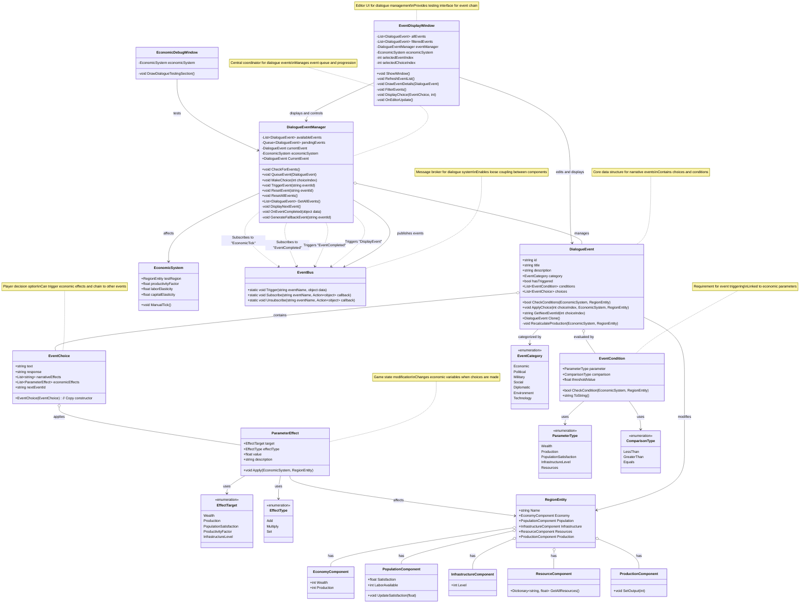

# 1. Game Design Document

## 1. Game Overview

- **Title**: Economic Cycles
- **Genre**: Roguelike Grand Strategy + Economic Simulator
- **Pitch**: A satirical economic strategy game where players guide a nation through booms, busts, and generational change in a world of absurd policies, trade rifts, and bureaucratic comedy.

## 2. Core Gameplay Loop

- **Turn Structure**: Strategic Assessment → Development Decisions → External Relations → End Turn Processing
- **Run Structure**: 30–40 year runs; generational shifts simulate longer-term change, affecting resources, infrastructure, and narrative state.
- **Meta-progression**: Unlocks new nations, policies, and conditions over multiple runs.

## 3. Inspirations & Influences

### Gameplay Influences
| Game                  | Influence                                               |
|-----------------------|---------------------------------------------------------|
| Crusader Kings        | Emergent storytelling, generational structure          |
| Europa Universalis IV | Regional simulation, production chains, trade nodes    |
| Slay the Spire        | Meta-progression and run-based structure               |
| Frostpunk             | Systems + story interplay, difficult trade-offs        |
| Dwarf Fortress        | Simulation depth, emergent chaos                       |
| FTL: Faster Than Light | Procedural run structure, branching node-based progression |

### Narrative & Thematic Influences
- Terry Pratchett (absurdism, wit, worldbuilding)
- Black Mirror (societal satire, system logic)
- Bureaucratic comedy (e.g., The Thick of It, Yes Minister)
- Historical satire and soft anachronisms

## 4. Core Features & Mechanics

### Summary Table
| Feature               | Description                                                                 |
|-----------------------|-----------------------------------------------------------------------------|
| Economic Cycles       | Boom → Peak → Recession → Recovery affecting gameplay conditions           |
| Generational Shifts   | Change in demographics, technology, and production after each run          |
| Infrastructure System | Region-based levels that boost output and enable projects                  |
| Policy Decisions      | Game-wide or regional decisions with trade-offs and cooldowns              |
| Event System          | Narrative and systemic events triggered by economic/political thresholds   |
| Production Chains     | Basic → Advanced resource refinement affecting outputs                     |
| Population Satisfaction | Driven by fulfillment of needs; affects productivity and unrest          |
| Meta-Progression      | Unlocks over multiple runs (nations, traits, techs)                        |

## 5. Major Game Systems

### 5.1 Economic System
- Sectors: Agriculture, Industry, Commerce, etc.
- Inputs/outputs, infrastructure multipliers, labor dependency
- Implements Cobb-Douglas production (Output = A × L^α × K^β)
- Economic cycles apply phase-based multipliers to wealth and production
- Price volatility introduces strategic unpredictability in supply-demand balancing

### 5.2 Resource System
- Primary (timber, food) and secondary (textiles, consumer goods)
- Regional surplus/shortage mechanics and interdependence
- Dynamic pricing based on supply/demand imbalance and elasticity
- Substitution logic via cross-price elasticity

### 5.3 Population System
- Labor availability, satisfaction, unrest
- Class dynamics and demographic shifts
- Wealth-based consumption modeling
- Unmet needs lower satisfaction and trigger unrest events

### 5.4 Infrastructure & Projects
- Level-based bonuses
- Enables regional specialization and unlocks
- Infrastructure boosts production efficiency
- Maintenance cost reduces wealth each turn

### 5.5 Event & Narrative System
- Triggered by cycles, policies, population status
- Ties back to tone and world state
- Supports conditional dialogue with player stats (e.g., Charisma, Intelligence)
- Implements modular narrative logic (intro → choice → consequence)
- Tracks event flags like “MediaScandalActive” for persistent outcomes

### 5.6 Diplomacy & Trade (Planned)
- Future expansion with routes and inter-nation strategy

## 6. Meta Systems & Replayability

- Generational transitions simulate legacy and systemic decay/progress
- Unlockable nations, ideologies, technologies
- Randomized events and world states ensure variation
- Thought Cabinet system:
  - Ideologies are discovered or chosen through events or conditions
  - Thoughts require incubation (delayed activation) and provide permanent buffs/debuffs
  - Ministers and factions react to ideological shifts
  - Conflicting ideologies block each other, shaping national doctrine

## 7. Narrative, Tone & Worldbuilding

- Fictional historical era: 16th–17th century inspiration
- Nations loosely inspired by real cultures
- Humor via satire, cosmic weirdness, and bureaucratic absurdity
- Anachronisms: TikTok guilds, Ministry of Optimistic Projections
- Ministers maintain relationships and memory of player decisions
- Dynamic events evolve from simulation context and active ideologies
- Anachronistic and surreal events integrated into narrative layers

## 8. Art & Visual Style

- Satirical and stylized historical map presentation (planned)
- Dashboards and region overlays over pure visual fidelity
- Event cards with illustrations and flavor text

## 9. UI/UX Design

- Region dashboards and nation-wide summaries
- Minimal micromanagement, high-level directives
- Emphasis on readable data and player comprehension

## 10. Technical Design

- **Architecture**: ECS + MVC hybrid
- **ScriptableObjects** for static data: nation, project, terrain, events
- **EventBus** system for decoupling
- Modular, debug-driven prototyping
- Unity + editor tools for turn simulation
- Dialogue engine supports stat-based skill checks and dice rolls
- Event system supports delayed callbacks and chained consequences
- National stats stored in runtime component and updated from game state
- Debug-first tooling used to prototype and test economic logic and narrative flow

## 11. Milestones & Implementation Strategy

- Core loop in place via editor/debug windows
- V1: full economic simulation of a single region
- V2: add multiple regions, UI overlays, and full project system
- V3+: events, generation shifts, meta-progression, diplomacy

## 12. Design Pillars & Constraints

- Systemic over scripted
- Strategic, not micromanaged
- Replayability via variation and legacy
- Humor as a spice, not the dish

## 13. Appendices

- Glossary
- Debug tools and simulation functions
- System flow diagrams (pending)
- Pseudocode for turn logic and economic processing

## Appendix: Design Notes and Future Concepts

This appendix contains design ideas that are not yet part of the core GDD, but may be integrated or expanded upon in future iterations.

### 🧮 Economic Model Extensions

- **Supply & Demand Mechanics**
  - Dynamic price = BasePrice × (1 + (Demand - Supply) / Elasticity)
  - Elasticity varies per resource
  - Demand influenced by population, wealth, infrastructure
  - Supply driven by infrastructure, terrain, and production efficiency

- **Elasticity & Substitution**
  - Income elasticity: richer populations consume more
  - Cross-price elasticity: substitution logic (e.g., rice vs bread)

- **Cobb-Douglas Production Function**
  - Output = A × L^α × K^β
  - A = productivity factor; L = labor; K = capital; α/β = elasticity coefficients

- **Infrastructure Impact**
  - Efficiency boost = 1 + level × modifier
  - Potential decay and maintenance costs

- **Consumption Modeling**
  - Wealth-based consumption formula
  - Unmet demand leads to unrest and stagnation

- **Economic Cycle Integration**
  - CycleEffect = PhaseModifier × Coefficient
  - Influences production, unrest, prices

- **Price Volatility**
  - Price(t+1) = Price(t) + α × (SupplyShock - ConsumptionTrend)
  - Random market shocks and feedback loops

### 🎭 RPG-Style Event Mechanics

- **Player Stats & Traits**
  - Charisma, Intelligence, Political Capital, Credibility, etc.
  - Tracked in a PlayerStats component

- **Skill Checks & Dice Rolls**
  - Dialogue outcomes gated behind skill thresholds or random rolls
  - Simple d20 implementation for choice branches

- **Event Memory System**
  - Choices leave flags like “MediaScandalActive = true”
  - Affects future event branches and tone

- **Minister & Faction Relationships**
  - Track trust/distrust levels with key characters
  - Choices influence future support or conflict

- **Conditional Dialogue Templates**
  - Modular text built from:
    - Intro → Conflict → Choice → Consequence
  - Context-aware fragments use game state variables

### 🧠 National Thought Cabinet System (Inspired by Disco Elysium)

- **Core Concept**
  - Ideologies or doctrines are researched like "thoughts"
  - Incubation period → permanent nation-level modifier

- **Examples**
  - “Agrarian Exceptionalism”: Boosts food output, slows industry
  - “Invisible Hand Manifesto”: Improves market efficiency, raises inequality

- **Incubation Effects**
  - Temporary instability, bureaucracy conflict
  - Ministers react, events adapt

- **Systemic Hooks**
  - Modify equations (production, pricing)
  - Alter faction satisfaction and unlock content
  - Conflicting doctrines block each other

### 🌐 Roguelike Event Tree

- **Branching Nodes**
  - Events, crises, ideologies form a branching meta-structure
  - Players navigate ideological progression like a policy map

- **Reactive Progression**
  - Nodes appear based on state triggers or economic phases
  - Player decisions or world conditions unlock future branches

- **Dynamic Outcomes**
  - Narrative arcs change based on prior decisions
  - Meta-paths shape tone and direction of the run

### 🧰 Real-Time & Tick-Based Hybrid Time Model

- Time flows in months/weeks; events trigger asynchronously
- Nodes or crises trigger automatically or are queued for player decision
- Events create a living, reactive policy layer over a stable economic sim

### 🎨 Visual & Thematic Concepts

- **Visual Style**
  - Bureaucratic retro aesthetic (folders, stamps, maps, red tape)
  - Stylized dashboards and absurd paperwork UI

- **Narrative Flavor**
  - Ministers with ludicrous titles
  - Events range from plausible crises to surreal absurdities
  - Tooltip humor and achievement flavor text

- **Audio Direction**
  - Ambient orchestral or lo-fi industrial
  - Thematic cues for satire, crisis, or prosperity

### 📌 Future Development Concepts

- Policy tech tree vs. event chaos layer
- Emergent ideology blending (e.g., technocratic populism)
- Replay map showing past generations' ideologies and events
- Experimental debug-first scripting for narrative flow control
- Procedurally generated historical timeline
- Constrained number of actions/interactions/influence in a given area/time 
- Monthly newspaper published chronicaling your game

# 2. Project Plan
 
## Phase 1: Core Simulation & Dialogue Foundations
 
This phase focuses on implementing the foundational systems required for economic simulation and narrative delivery. The goal is to produce a fully functional vertical slice that allows turn progression, economic changes in regions, and event-driven dialogue interactions.
 
### Objectives
 
- ✅ Implement turn-based structure with EventBus communication
- ✅ Create GameManager and TurnManager for simulation control
- ✅ Initialize MapModel with one or more test regions
- ⏳ Finalize RegionEntity architecture and all core components
- ⏳ Develop production and consumption flows using ResourceComponent and ProductionComponent
- ⏳ Introduce economic cycles with basic phase effects via EconomicCycleSystem
- ⏳ Visualize economic state through debug logs or minimal UI
 
### Narrative & Event System
 
- ✅ EventDialogueManager with basic dialogue display
- ⏳ Implement dialogue event loading and triggering from events
- ⏳ Link narrative flags to game state (e.g., satisfaction, resources)
- ⏳ Create sample dialogue events with multiple branches
- ⏳ Integrate DialogueOutcome with GameStateManager for persistent effects
 
### Vertical Slice Goals
 
- End-turn progression updates economy
- Population satisfaction reflects economic outcomes
- Triggered event dialogue based on region conditions
- Debug tools to simulate, test, and validate logic paths


# 3. Game Architecture

## Architecture Components

### 1. Data Layer (ScriptableObjects)
While the overall architecture mentions ScriptableObjects, none are directly visible in the provided git files. References to them exist in code comments.

### 2. Entity Component System (Game Logic)

#### Entities (Domain Objects)

| Entity | Purpose | Implementation Status |
|--------|---------|------------------------|
| **RegionEntity** | Represents an economic region with components | Implemented in `3_Entities/RegionEntity.cs` |
| **NationEntity** | Not visible in current files | Not found in provided files |
| **ProjectEntity** | Not visible in current files | Not found in provided files |

#### Components (Data Containers)

| Component | Purpose | Implementation Status |
|-----------|---------|------------------------|
| **ResourceComponent** | Manages basic resources (Food, Wood) with generation and access methods | Implemented in `4_Components/RegionComponents/ResourceComponent.cs` |
| **ProductionComponent** | Processes production from resources with simplified output calculation | Implemented in `4_Components/RegionComponents/ProductionComponent.cs` |
| **RegionEconomyComponent** | Tracks wealth and production values for a region | Implemented in `4_Components/RegionComponents/RegionEconomyComponent.cs` |
| **PopulationComponent** | Manages labor availability and satisfaction | Implemented in `4_Components/RegionComponents/PopulationComponent.cs` |
| **InfrastructureComponent** | Basic implementation with level tracking and maintenance costs | Implemented in `4_Components/RegionComponents/InfrastructureComponent.cs` |

#### Systems (Logic Processors)

| System | Purpose | Implementation Status |
|--------|---------|------------------------|
| **EconomicSystem** | Processes economic simulation including supply/demand, production, infrastructure, cycles | Implemented in `5_Systems/EconomicSystem.cs` |
| **Other systems** | Not visible in current files | Not found in provided files |

### 3. Core Management

| Component | Purpose | Implementation Status |
|-----------|---------|------------------------|
| **GameManager** | Singleton that manages game state and test region | Implemented in `1_Core/GameManager.cs` |
| **TurnManager** | Handles turn progression, time controls, and turn events | Implemented in `1_Core/TurnManager.cs` |
| **EventBus** | Central event communication system with subscription management | Implemented in `8_Managers/EventBus.cs` |

### 4. Event System (Communication Layer)

| Key Event | Triggered By | Subscribed By | Implementation Status |
|-----------|--------------|---------------|------------------------|
| **TurnEnded** | TurnManager | GameManager, EconomicSystem | Implemented |
| **RegionUpdated** | RegionEntity | EconomicSystem | Implemented |
| **RegionsUpdated** | GameManager | Not visible in files | Implemented |
| **GameReset** | GameManager | Not visible in files | Implemented |

## Folder Structure Implementation

The current implementation follows a numbered folder structure:

```
Assets/Scripts/V2/
  ├── 1_Core/
  │    ├── GameManager.cs
  │    └── TurnManager.cs
  ├── 2_Data/
  │    └── [Empty or not visible in provided files]
  ├── 3_Entities/
  │    └── RegionEntity.cs
  ├── 4_Components/
  │    └── RegionComponents/
  │         ├── ResourceComponent.cs
  │         ├── ProductionComponent.cs
  │         ├── RegionEconomyComponent.cs
  │         ├── PopulationComponent.cs
  │         └── InfrastructureComponent.cs
  ├── 5_Systems/
  │    └── EconomicSystem.cs
  ├── 6_UI/
  │    └── [Empty or not visible in provided files]
  ├── 7_Controllers/
  │    └── [Empty or not visible in provided files]
  ├── 8_Managers/
  │    └── EventBus.cs
  └── 9_Utils/
       └── [Empty or not visible in provided files]
```

## Implementation Details

### RegionEntity Implementation
```csharp
public class RegionEntity
{
    // Identity
    public string Name { get; set; }
    
    // Components
    public ResourceComponent Resources { get; private set; }
    public ProductionComponent Production { get; private set; }
    public RegionEconomyComponent Economy { get; private set; }
    public InfrastructureComponent Infrastructure { get; private set; }
    public PopulationComponent Population { get; private set; }

    // Processing methods
    public void ProcessTurn() { ... }
    public string GetSummary() { ... }
}
```

### EventBus Implementation
```csharp
public static class EventBus
{
    private static Dictionary<string, Action<object>> eventDictionary = new();
    
    // Core methods
    public static void Subscribe(string eventName, Action<object> listener) { ... }
    public static void Unsubscribe(string eventName, Action<object> listener) { ... }
    public static void Trigger(string eventName, object eventData = null) { ... }
}
```

### EconomicSystem Implementation
```csharp
public class EconomicSystem : MonoBehaviour
{
    // Singleton pattern
    public static EconomicSystem Instance { get; private set; }
    
    // References
    public RegionEntity testRegion;
    
    // Economic processing methods
    public void ProcessEconomicTick() { ... }
    private void ProcessSupplyAndDemand(RegionEntity region) { ... }
    private void ProcessProduction(RegionEntity region) { ... }
    private void ProcessInfrastructure(RegionEntity region) { ... }
    private void ProcessPopulationConsumption(RegionEntity region) { ... }
    private void ProcessEconomicCycle(RegionEntity region) { ... }
    private void ProcessPriceVolatility() { ... }
}
```

## Current Architecture Analysis

The current implementation shows:

1. **Strong Component Architecture**: RegionEntity uses composition with specialized components for different aspects of gameplay.

2. **Event-Driven Communication**: EventBus implementation with subscription/unsubscription and event triggering.

3. **Singleton Pattern**: Used for GameManager and EconomicSystem for global access.

4. **Turn-Based Simulation**: TurnManager handles progression with pause/resume functionality.

5. **Early-Stage Economic Model**: 
   - Basic resource generation
   - Simple production conversion
   - Economic calculations using Cobb-Douglas model
   - Population satisfaction tracking
   - Infrastructure levels with maintenance costs

6. **Testing Framework**:
   - Single test region managed by GameManager
   - Console logging for debugging
   - Manual tick functionality in EconomicSystem

## Gap Analysis

Comparing the current implementation to the target architecture:

### Present Components
- Core event system
- Basic region entity with components
- Economic simulation foundation
- Turn-based progression
- Component-based architecture

### Missing Components
- ScriptableObjects data layer
- Nation entities
- Project entities
- MapSystem
- TradeSystem
- UI components
- Controllers
- State management system
- Dialogue system
- Economic cycle specialized components

## Next Implementation Steps

Based on the current state:

1. **Complete Resource System**
   - Expand beyond basic Food/Wood resources
   - Implement production chains
   - Add resource constraints

2. **Add Economic Cycle Component**
   - Implement cycle phases
   - Connect to EconomicSystem
   - Add phase-specific modifiers

3. **Develop Multi-Region Support**
   - Move from single test region to multi-region
   - Implement region relationships
   - Add nation grouping

4. **Implement UI Layer**
   - Create visualization for regions
   - Build economic dashboards
   - Develop interaction controls

5. **Add Data-Driven Configuration**
   - Implement ScriptableObjects
   - Move hardcoded values to data

The current implementation provides a solid foundation for the entity-component architecture and economic simulation core, requiring expansion to meet the full architectural vision.


# 4. Game Architecture Diagram
## Game Architecture


## Game Event Sequence


# 4. System Architecture Diagrams
## Economy Architecture


## Economy Flow

```mermaid
flowchart TD
    %% Main Economic Flow Concepts
    
    %% Resources & Inputs
    Labor["Labor\n(PopulationComponent)"] 
    Capital["Capital/Infrastructure\n(InfrastructureComponent)"]
    Resources["Resources\n(ResourceComponent)"]
    
    %% Core Economic Processes
    Production["Production Process\n(Cobb-Douglas Function)"]
    MarketDynamics["Market Dynamics\n(Supply & Demand)"]
    Consumption["Consumption\n(Population Needs)"]
    EconomicCycle["Economic Cycle\n(Growth & Contraction)"]
    
    %% Outputs & Results
    Wealth["Wealth Accumulation"]
    ProductionOutput["Production Output"]
    Satisfaction["Population Satisfaction"]
    MarketPrices["Market Prices & Volatility"]
    
    %% Main Flow Connections
    Labor -->|"Labor Input (L^α)"|Production
    Capital -->|"Capital Input (K^β)"|Production
    Resources -->|"Resource Consumption"|Production
    
    Production -->|"Generates"|ProductionOutput
    ProductionOutput -->|"Supply"|MarketDynamics
    ProductionOutput -->|"Contributes to"|Wealth
    
    Labor -->|"Creates Demand"|MarketDynamics
    Labor -->|"Population Size"|Consumption
    
    MarketDynamics -->|"Price Signals"|MarketPrices
    MarketDynamics -->|"Imbalance"|EconomicCycle
    
    ProductionOutput -->|"Available Goods"|Consumption
    Consumption -->|"Satisfaction Level"|Satisfaction
    
    EconomicCycle -->|"Multiplier Effect"|Production
    EconomicCycle -->|"Growth Rate"|Wealth
    EconomicCycle -->|"Volatility"|MarketPrices
    
    %% Maintenance & Decay
    Capital -->|"Decay Rate"|Capital
    Wealth -->|"Maintenance Costs"|Capital
    
    %% Parameter Influences
    Params["Economic Parameters"]
    Params -->|"Productivity Factor"|Production
    Params -->|"Labor Elasticity"|Production
    Params -->|"Capital Elasticity"|Production
    Params -->|"Cycle Multiplier"|EconomicCycle
    Params -->|"Wealth Growth Rate"|Wealth
    Params -->|"Price Volatility"|MarketPrices
    Params -->|"Decay Rate"|Capital
    Params -->|"Maintenance Cost"|Capital
    Params -->|"Consumption Rate"|Consumption
    
    %% Visual Styling with lighter backgrounds
    classDef input fill:#e8f5e9,stroke:#81c784,stroke-width:2px,color:#2e7d32,font-weight:bold
    classDef process fill:#fff8e1,stroke:#ffca28,stroke-width:2px,color:#f57f17,font-weight:bold
    classDef output fill:#e3f2fd,stroke:#64b5f6,stroke-width:2px,color:#1565c0,font-weight:bold
    classDef parameter fill:#f3e5f5,stroke:#ba68c8,stroke-width:2px,color:#7b1fa2,font-weight:bold
    
    class Labor,Capital,Resources input
    class Production,MarketDynamics,Consumption,EconomicCycle process
    class Wealth,ProductionOutput,Satisfaction,MarketPrices output
    class Params parameter
```



