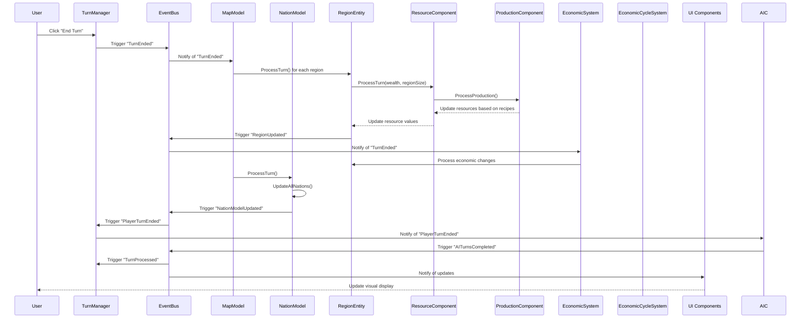
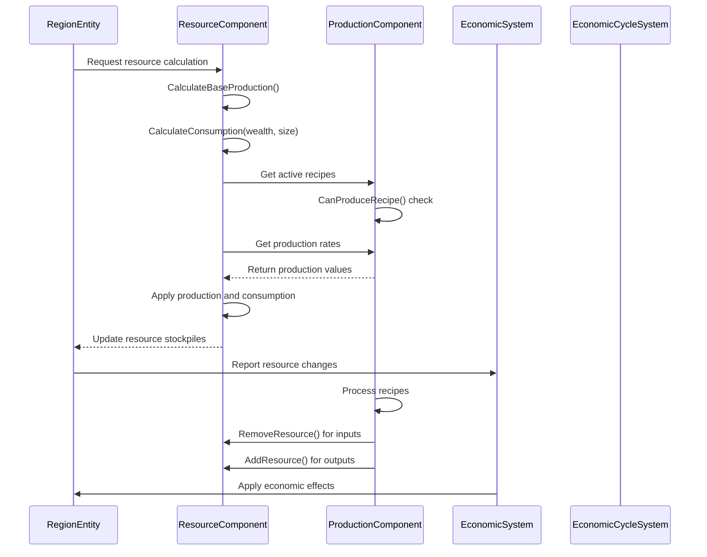
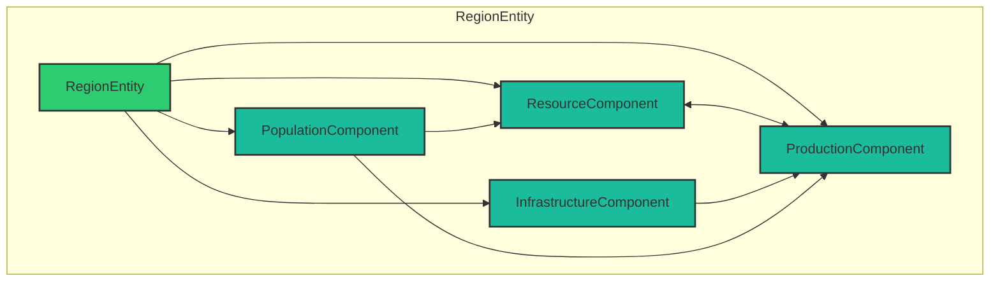
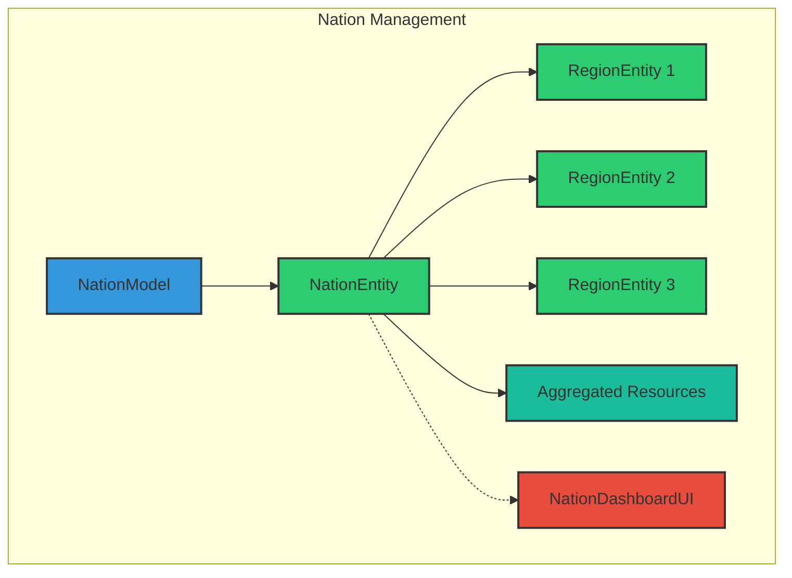
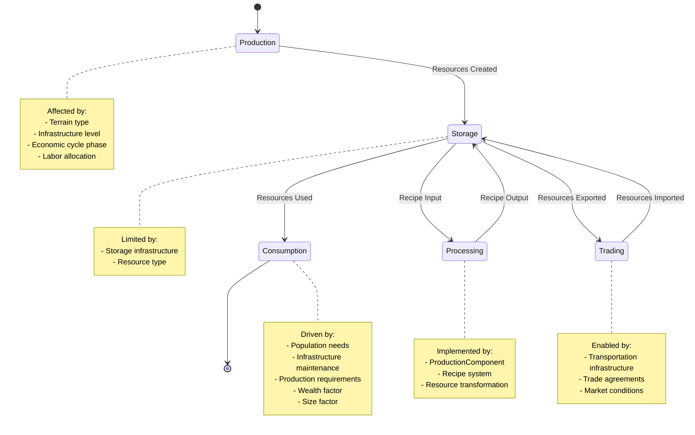
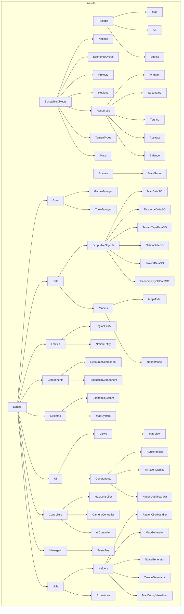
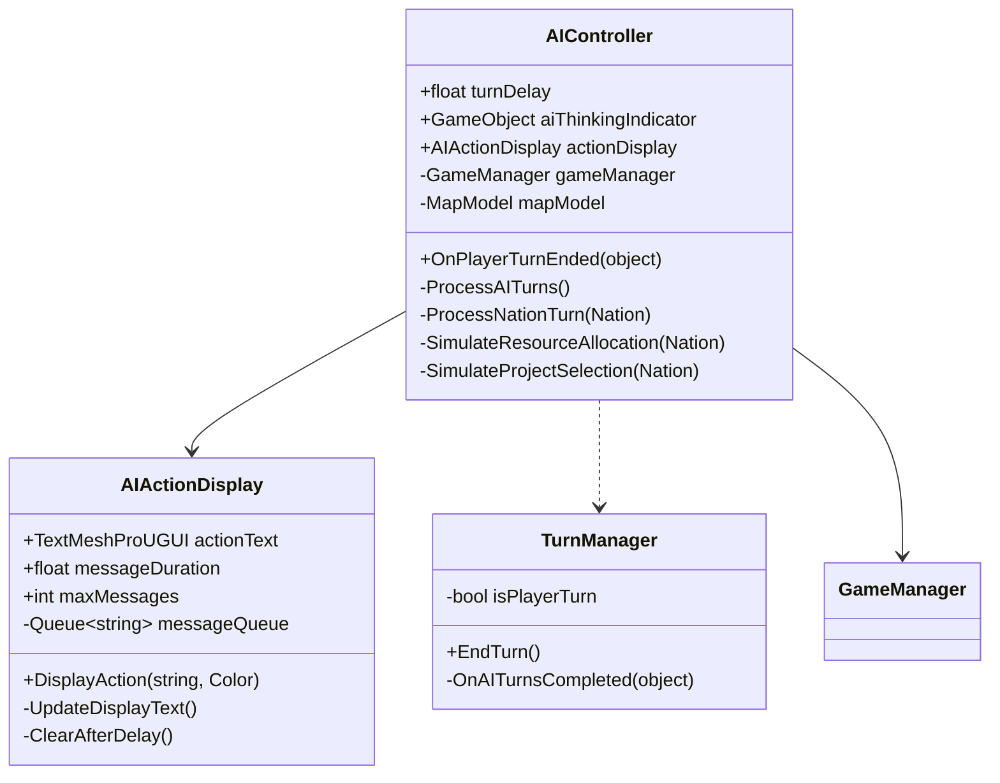
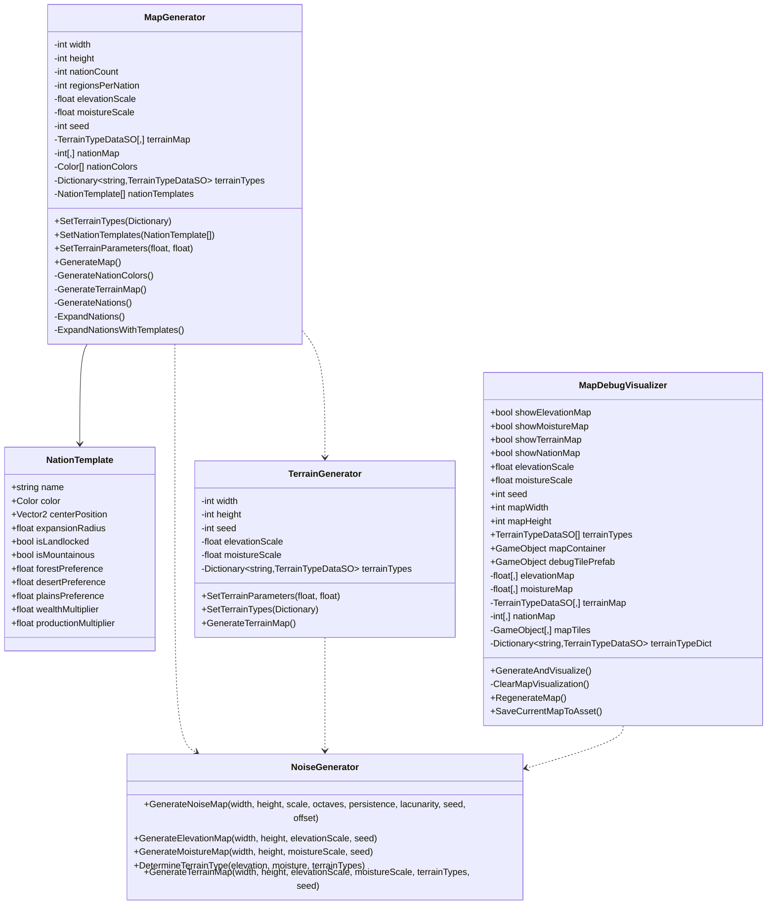

# Economic Cycles: Updated Architecture Diagram v2

## Core Architecture

```mermaid
graph TD
    %% Core Managers
    subgraph "Core Managers"
        GM[GameManager]
        TM[TurnManager]
        EM[EventBus]
    end

    %% Data Layer
    subgraph "Data Layer"
        SO[ScriptableObjects]
        subgraph "Models"
            MM[MapModel]
            ECM[EconomicCycleModel]
            NM[NationModel]
        end
    end

    %% Entities
    subgraph "Entities"
        RE[RegionEntity]
        NE[NationEntity]
        PE[ProjectEntity]
    end

    %% Components
    subgraph "Components"
        RC[ResourceComponent]
        PC[ProductionComponent]
        IC[InfrastructureComponent]
        POPC[PopulationComponent]
    end

    %% Systems
    subgraph "Systems"
        ECS[EconomicSystem]
        MS[MapSystem]
        PS[ProjectSystem]
        RTS[ResourceTradeSystem]
        ECS2[EconomicCycleSystem]
    end

    %% UI
    subgraph "User Interface"
        subgraph "Views"
            MV[MapView]
            RV[RegionView]
            EV[EconomicView]
            RDV[ResourceDashboardView]
        end
        subgraph "UI Components"
            RP[RegionPanel]
            RIU[RegionInfoUI]
            ED[EconomicDashboard]
            AAD[AIActionDisplay]
            NDU[NationDashboardUI]
        end
    end

    %% Controllers
    subgraph "Controllers"
        MC[MapController]
        CC[CameraController]
        PC2[ProjectController]
        AIC[AIController]
    end

    %% Utils
    subgraph "Utilities"
        MG[MapGenerator]
        RCH[RegionClickHandler]
        NG[NoiseGenerator]
        TG[TerrainGenerator]
        MDV[MapDebugVisualizer]
    end

    %% Major Relationships
    GM --> MM
    GM --> NM
    GM --> TM
    MM --> RE
    MM --> NM
    NM --> NE
    RE --> NE
    MM -.-> EM
    NM -.-> EM
    RE --> RC
    RE --> PC
    RE --> IC
    RE --> POPC
    
    MV --> SO
    MC -.-> EM
    MC --> GM
    
    MS -.-> EM
    MS --> MV
    
    ECS -.-> EM
    ECS --> RE
    ECS --> RC
    
    TM -.-> EM
    
    RCH -.-> EM
    
    EM -.-> MS
    EM -.-> ECS
    EM -.-> RIU
    EM -.-> MV
    EM -.-> ECS2
    EM -.-> NDU
    
    RIU --> RE
    RIU --> RC
    
    NE --> RE
    
    ECS2 --> RC
    ECS2 --> PC
    
    AIC -.-> EM
    AIC --> AAD
    
    NDU --> NE
    
    %% Resource System Connections
    RC --> RTS
    RC --> ECS
    ECS2 --> RC
    PC --> RC
    
    %% Added utility connections
    MG --> TG
    TG --> NG
    MG --> MM
    
    %% Legend
    classDef core fill:#ff9900,stroke:#333,stroke-width:2px
    classDef data fill:#3498db,stroke:#333,stroke-width:2px
    classDef entities fill:#2ecc71,stroke:#333,stroke-width:2px
    classDef components fill:#1abc9c,stroke:#333,stroke-width:2px
    classDef systems fill:#9b59b6,stroke:#333,stroke-width:2px
    classDef ui fill:#e74c3c,stroke:#333,stroke-width:2px
    classDef controllers fill:#f1c40f,stroke:#333,stroke-width:2px
    classDef events fill:#34495e,stroke:#333,stroke-width:2px
    classDef utils fill:#95a5a6,stroke:#333,stroke-width:2px
    
    class GM,TM,EM core
    class SO,MM,ECM,NM data
    class RE,NE,PE entities
    class RC,PC,IC,POPC components
    class ECS,MS,PS,RTS,ECS2 systems
    class MV,RV,EV,RDV,RP,RIU,ED,AAD,NDU ui
    class MC,CC,PC2,AIC controllers
    class MG,RCH,NG,TG,MDV utils
```

## Data Flow - Turn Processing

## Resource System Flow

## Components Relationship

## Nation Hierarchy

## Resource State Transitions

## Folder Structure (Updated)

## Resource System Design

```mermaid
classDiagram
    class ResourceComponent {
        -Dictionary~string,float~ resources
        -Dictionary~string,float~ productionRates
        -Dictionary~string,float~ consumptionRates
        -Dictionary~string,ResourceDataSO~ resourceDefinitions
        -float baseConsumptionFactor
        -float wealthConsumptionMultiplier
        -float sizeConsumptionMultiplier
        +ProcessTurn(wealth, size)
        +AddResource(string, float)
        +RemoveResource(string, float)
        +GetResourceAmount(string)
        +CalculateBaseProduction()
        +CalculateConsumption(wealth, size)
        +GetConsumptionSatisfaction()
        +GetOverallSatisfaction()
        +HasConsumptionNeeds()
        +LoadResourceDefinitions(ResourceDataSO[])
    }
    
    class RegionEntity {
        +string regionName
        +int wealth
        +int production
        +string ownerNationName
        +Color regionColor
        +TerrainTypeDataSO terrainType
        +bool hasChangedThisTurn
        +int wealthDelta
        +int productionDelta
        +ResourceComponent resources
        +ProductionComponent productionComponent
        +UpdateEconomy(int, int)
        +ResetChangeFlags()
        +GetDescription()
        +GetDetailedDescription()
    }
    
    class ProductionComponent {
        -List~string~ activeRecipes
        -float productionEfficiency
        -Dictionary~string,float~ recipeProgress
        +ProcessProduction()
        +CanProduceRecipe(recipe)
        +ProduceRecipe(recipe)
        +ActivateRecipe(string)
        +DeactivateRecipe(string)
        +SetProductionEfficiency(float)
        +GetRecipeProgress(string)
        +GetActiveRecipes()
        +GetAvailableRecipes()
    }
    
    class ResourceDataSO {
        +string resourceName
        +ResourceType resourceType
        +ResourceCategory category
        +float baseValue
        +float marketVolatility
        +float maxStoragePerCapacity
        +float perishRate
        +float transportFactor
        +float weightPerUnit
        +bool isRawResource
        +ResourceProductionRecipe[] productionRecipes
    }
    
    class ResourceProductionRecipe {
        +string recipeName
        +ResourceInput[] inputs
        +float outputAmount
        +float productionTime
        +string requiredInfrastructureType
        +int minimumInfrastructureLevel
    }
    
    class NationEntity {
        +string nationName
        +Color nationColor
        +List~RegionEntity~ regions
        -int totalWealth
        -int totalProduction
        -Dictionary~string,float~ aggregatedResources
        -Dictionary~string,float~ aggregatedProduction
        -Dictionary~string,float~ aggregatedConsumption
        +AddRegion(RegionEntity)
        +RemoveRegion(RegionEntity)
        +UpdateAggregatedData()
        +GetTotalWealth()
        +GetTotalProduction()
        +GetAggregatedResources()
        +GetAggregatedProduction()
        +GetAggregatedConsumption()
        +GetResourceBalance()
        +GetNationSummary()
    }
    
    class NationModel {
        -Dictionary~string,NationEntity~ nations
        -NationEntity selectedNation
        +RegisterRegion(RegionEntity)
        +GetNation(string)
        +GetAllNations()
        +SelectNation(string)
        +GetSelectedNation()
        +UpdateAllNations()
        +ProcessTurn()
        +GetGlobalResourceBalance()
    }
    
    RegionEntity "1" --> "1" ResourceComponent
    RegionEntity "1" --> "1" ProductionComponent
    ResourceComponent ..> ResourceDataSO
    ProductionComponent ..> ResourceProductionRecipe
    ResourceDataSO *-- ResourceProductionRecipe
    NationEntity "1" o-- "many" RegionEntity
    NationModel "1" o-- "many" NationEntity
```

## AI Controller and System

## Map Generation System

## Implementation Status

| Component | Status | Description |
|-----------|--------|-------------|
| Core Managers | ✅ Implemented | GameManager, TurnManager, EventBus |
| Map Generation | ✅ Implemented | Terrain and nation procedural generation |
| Region Management | ✅ Implemented | Basic region functionality with terrain |
| Resource System | ✅ Implemented | Resource tracking with production/consumption |
| Production System | ✅ Implemented | Recipe-based resource transformation |
| Nation System | ✅ Implemented | Nation entities, aggregation, UI |
| Economic Cycles | 🟨 Partial | Framework ready, implementation pending |
| AI Nations | ✅ Implemented | Basic AI turns with decision simulation |
| UI Elements | ✅ Implemented | Map view, region info, nation dashboard |
| Project System | 🟨 Partial | Data structure ready, interaction pending |
| Population System | 📝 Planned | Data structure defined, not implemented |
| Infrastructure | 📝 Planned | Data structure defined, not implemented |

## Event System Communication

| Event Name | Triggered By | Subscribed By | Status |
|------------|--------------|---------------|--------|
| RegionCreated | MapModel | EconomicSystem | ✅ |
| RegionUpdated | RegionEntity | MapView, RegionInfoUI | ✅ |
| RegionSelected | MapController | RegionInfoUI, MapView | ✅ |
| TurnEnded | TurnManager | EconomicSystem, MapModel | ✅ |
| TurnStarted | TurnManager | Various Systems | ✅ |
| TurnProcessed | TurnManager | UI Components | ✅ |
| PlayerTurnEnded | TurnManager | AIController | ✅ |
| AITurnsCompleted | AIController | TurnManager | ✅ |
| EconomicSystemReady | EconomicSystem | MapView | ✅ |
| NationUpdated | NationEntity | NationDashboardUI | ✅ |
| NationSelected | NationModel | NationDashboardUI | ✅ |
| NationModelUpdated | NationModel | UI Components | ✅ |
| RegionClicked | RegionClickHandler | MapController | ✅ |
| EconomicCycleChanged | EconomicCycleSystem | Multiple Systems | 🟨 |