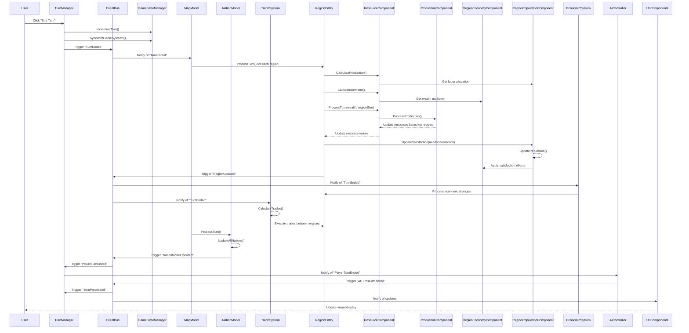
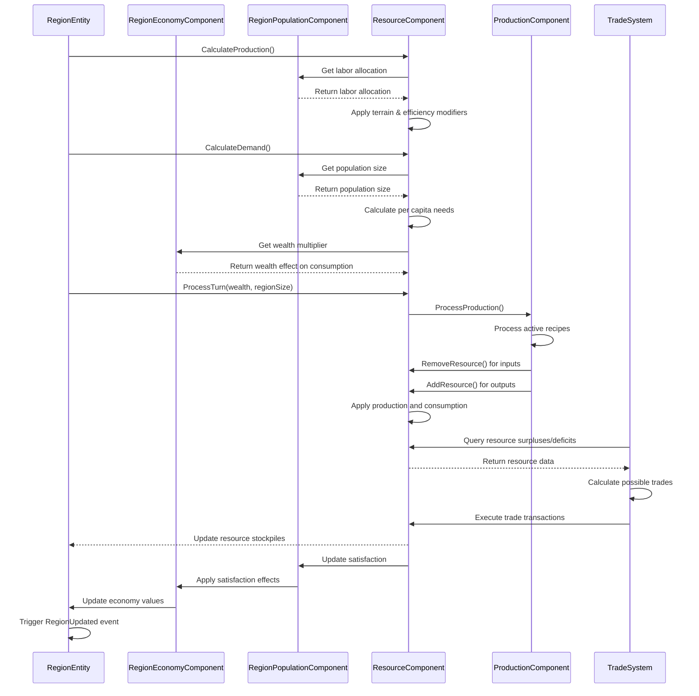
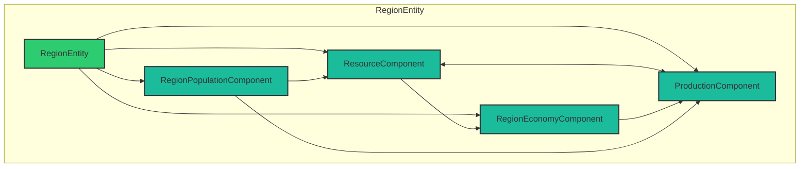
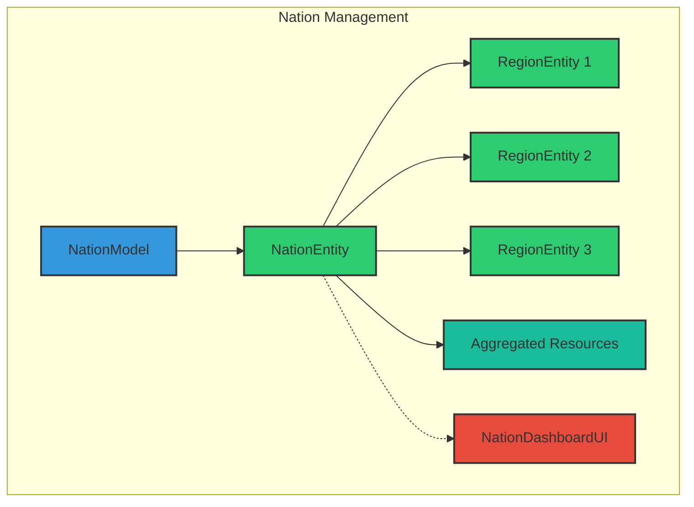
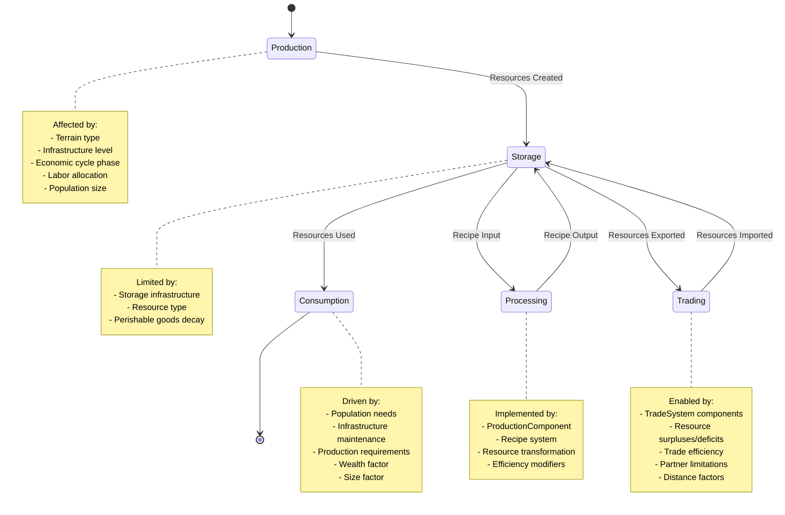
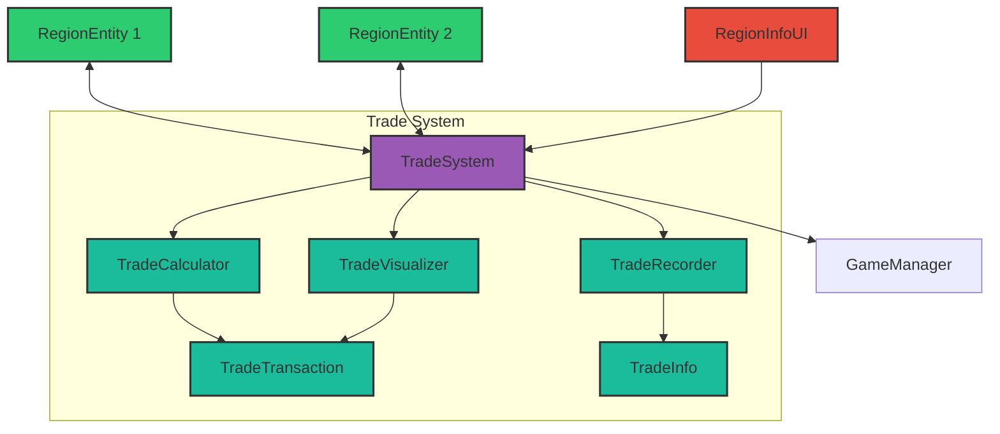
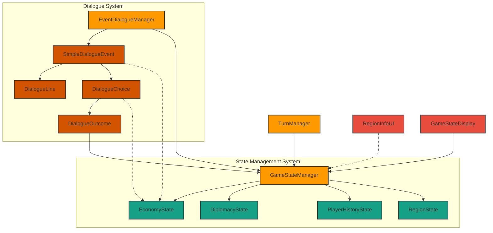
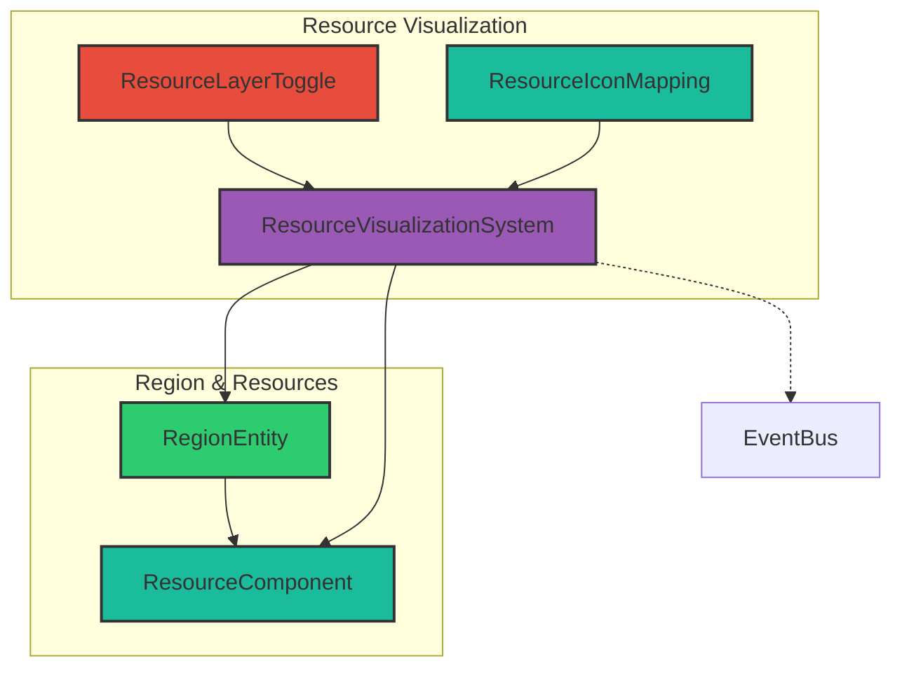

# Economic Cycles: Updated Architecture Diagram v5

## Core Architecture

```mermaid
graph TD
    %% Core Managers
    subgraph "Core Managers"
        GM[GameManager]
        TM[TurnManager]
        EM[EventBus]
        GSM[GameStateManager]
        EDM[EventDialogueManager]
    end

    %% Data Layer
    subgraph "Data Layer"
        SO[ScriptableObjects]
        subgraph "Models"
            MM[MapModel]
            ECM[EconomicCycleModel]
            NM[NationModel]
        end
        subgraph "State Models"
            ES[EconomyState]
            DS[DiplomacyState]
            PHS[PlayerHistoryState]
            RS[RegionState]
        end
        subgraph "Dialogue Models"
            SDE[SimpleDialogueEvent]
            DL[DialogueLine]
            DC[DialogueChoice]
            DO[DialogueOutcome]
        end
    end

    %% Entities
    subgraph "Entities"
        RE[RegionEntity]
        NE[NationEntity]
        PE[ProjectEntity]
    end

    %% Components
    subgraph "Components"
        RC[ResourceComponent]
        PC[ProductionComponent]
        REC[RegionEconomyComponent]
        POPC[RegionPopulationComponent]
        IC[InfrastructureComponent]
    end

    %% Systems
    subgraph "Systems"
        ECS[EconomicSystem]
        MS[MapSystem]
        PS[ProjectSystem]
        RTS[TradeSystem]
        ECS2[EconomicCycleSystem]
        RVS[ResourceVisualizationSystem]
    end

    %% Trade System Components
    subgraph "Trade System Components"
        TC[TradeCalculator]
        TV[TradeVisualizer]
        TR[TradeRecorder]
        TT[TradeTransaction]
        TI[TradeInfo]
    end

    %% UI
    subgraph "User Interface"
        subgraph "Views"
            MV[MapView]
            RV[RegionView]
            EV[EconomicView]
            RDV[ResourceDashboardView]
        end
        subgraph "UI Components"
            RP[RegionPanel]
            RIU[RegionInfoUI]
            ED[EconomicDashboard]
            AAD[AIActionDisplay]
            NDU[NationDashboardUI]
            GSD[GameStateDisplay]
            RLT[ResourceLayerToggle]
        end
    end

    %% Controllers
    subgraph "Controllers"
        MC[MapController]
        CC[CameraController]
        PC2[ProjectController]
        AIC[AIController]
    end

    %% Utils
    subgraph "Utilities"
        MG[MapGenerator]
        RCH[RegionClickHandler]
        NG[NoiseGenerator]
        TG[TerrainGenerator]
        MDV[MapDebugVisualizer]
        DST[DialogueSystemTester]
        GSD2[GameStateDebugger]
    end

    %% Major Relationships
    GM --> MM
    GM --> NM
    GM --> TM
    MM --> RE
    MM --> NM
    NM --> NE
    RE --> NE
    MM -.-> EM
    NM -.-> EM
    RE --> RC
    RE --> PC
    RE --> REC
    RE --> POPC
    
    MV --> SO
    MC -.-> EM
    MC --> GM
    
    MS -.-> EM
    MS --> MV
    
    ECS -.-> EM
    ECS --> RE
    ECS --> RC
    
    TM -.-> EM
    TM --> GSM
    
    RCH -.-> EM
    
    EM -.-> MS
    EM -.-> ECS
    EM -.-> RIU
    EM -.-> MV
    EM -.-> ECS2
    EM -.-> NDU
    EM -.-> GSD
    
    RIU --> RE
    RIU --> RC
    RIU --> RTS
    
    NE --> RE
    
    ECS2 --> RC
    ECS2 --> PC
    
    AIC -.-> EM
    AIC --> AAD
    AIC --> GM
    
    NDU --> NE
    
    GSM --> ES
    GSM --> DS 
    GSM --> PHS
    GSM --> RS
    
    EDM --> SDE
    SDE --> DL
    SDE --> DC
    DC --> DO
    EDM --> GSM
    
    RVS -.-> EM
    RVS --> RE
    RLT --> RVS
    
    %% Trade System Connections
    RTS --> TC
    RTS --> TV
    RTS --> TR
    TR --> TI
    TC --> TT
    RTS --> GM
    RTS -.-> EM
    
    %% Added utility connections
    MG --> TG
    TG --> NG
    MG --> MM
    
    DST --> EDM
    DST --> GSM
    GSD2 --> GSM
    
    %% Legend
    classDef core fill:#ff9900,stroke:#333,stroke-width:2px
    classDef data fill:#3498db,stroke:#333,stroke-width:2px
    classDef entities fill:#2ecc71,stroke:#333,stroke-width:2px
    classDef components fill:#1abc9c,stroke:#333,stroke-width:2px
    classDef systems fill:#9b59b6,stroke:#333,stroke-width:2px
    classDef ui fill:#e74c3c,stroke:#333,stroke-width:2px
    classDef controllers fill:#f1c40f,stroke:#333,stroke-width:2px
    classDef events fill:#34495e,stroke:#333,stroke-width:2px
    classDef utils fill:#95a5a6,stroke:#333,stroke-width:2px
    classDef trade fill:#8e44ad,stroke:#333,stroke-width:2px
    classDef state fill:#16a085,stroke:#333,stroke-width:2px
    classDef dialogue fill:#d35400,stroke:#333,stroke-width:2px
    
    class GM,TM,EM,GSM,EDM core
    class SO,MM,ECM,NM data
    class ES,DS,PHS,RS state
    class SDE,DL,DC,DO dialogue
    class RE,NE,PE entities
    class RC,PC,REC,POPC,IC components
    class ECS,MS,PS,RTS,ECS2,RVS systems
    class MV,RV,EV,RDV,RP,RIU,ED,AAD,NDU,GSD,RLT ui
    class MC,CC,PC2,AIC controllers
    class MG,RCH,NG,TG,MDV,DST,GSD2 utils
    class TC,TV,TR,TT,TI trade
```

## Data Flow - Turn Processing

## Resource System Flow

## Components Relationship

## Nation Hierarchy

## Resource State Transitions

## Trade System Structure

## State & Dialogue System

## Resource Visualization System

## Folder Structure (Updated)

```mermaid
graph TD
    subgraph "Assets"
        Prefabs --> Map
        Prefabs --> UI
        Prefabs --> Effects
        
        ScriptableObjects --> Nations
        ScriptableObjects --> EconomicCycles
        ScriptableObjects --> Projects
        ScriptableObjects --> Regions
        ScriptableObjects --> Resources
        ScriptableObjects --> TerrainTypes
        ScriptableObjects --> Maps
        ScriptableObjects --> Test
        
        Resources --> Primary
        Resources --> Secondary
        Resources --> Tertiary
        Resources --> Abstract
        Resources --> Balance
        
        Scenes --> MainGame
        
        Scripts --> Core
        Scripts --> Data
        Scripts --> Entities
        Scripts --> Components
        Scripts --> Systems
        Scripts --> UI_Scripts[UI]
        Scripts --> Controllers
        Scripts --> Managers
        Scripts --> Utils
        
        Core --> GameManager
        Core --> TurnManager
        Core --> GameStateManager
        Core --> EventDialogueManager
        
        Data --> ScriptableObjects_Script[ScriptableObjects]
        Data --> Models
        
        ScriptableObjects_Script --> MapDataSO
        ScriptableObjects_Script --> ResourceDataSO
        ScriptableObjects_Script --> TerrainTypeDataSO
        ScriptableObjects_Script --> NationDataSO
        ScriptableObjects_Script --> ProjectDataSO
        ScriptableObjects_Script --> EconomicCycleDataSO
        ScriptableObjects_Script --> TerrainMapDataSO
        
        Models --> MapModel
        Models --> NationModel
        Models --> EconomyState
        Models --> DiplomacyState
        Models --> PlayerHistoryState
        Models --> RegionState
        Models --> SimpleDialogueEvent
        
        Entities --> RegionEntity
        Entities --> NationEntity
        
        Components --> RegionComponents
        
        RegionComponents --> ResourceComponent
        RegionComponents --> ProductionComponent
        RegionComponents --> RegionEconomyComponent
        RegionComponents --> RegionPopulationComponent
        
        Systems --> EconomicSystem
        Systems --> MapSystem
        Systems --> TradeSystems
        Systems --> ResourceVisualizationSystem
        
        TradeSystems --> TradeSystem
        TradeSystems --> zSubSystems
        
        zSubSystems --> TradeCalculator
        zSubSystems --> TradeRecorder
        zSubSystems --> TradeVisualizer
        zSubSystems --> TradeTransaction
        zSubSystems --> TradeInfo
        
        UI_Scripts --> Views
        UI_Scripts --> Components
        
        Views --> MapView
        Components --> RegionInfoUI
        Components --> AIActionDisplay
        Components --> NationDashboardUI
        Components --> SpinningWheel
        Components --> GameStateDisplay
        Components --> ResourceLayerToggle
        
        Controllers --> MapController
        Controllers --> CameraController
        Controllers --> AIController
        
        Managers --> EventBus
        
        Utils --> Helpers
        Utils --> Extensions
        
        Helpers --> RegionClickHandler
        Helpers --> RegionBehavior
        Helpers --> MapGenerator
        Helpers --> MapManager
        Helpers --> NoiseGenerator
        Helpers --> TerrainGenerator
        Helpers --> MapDebugVisualizer
        Helpers --> DialogueSystemTester
        Helpers --> GameStateDebugger
    end
```

