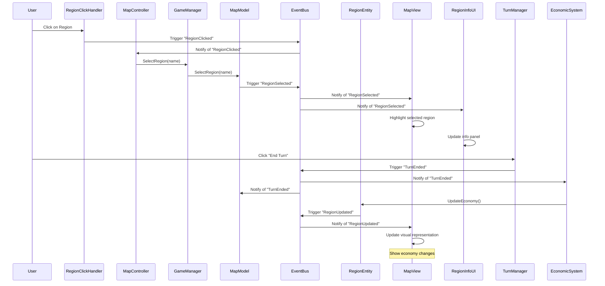
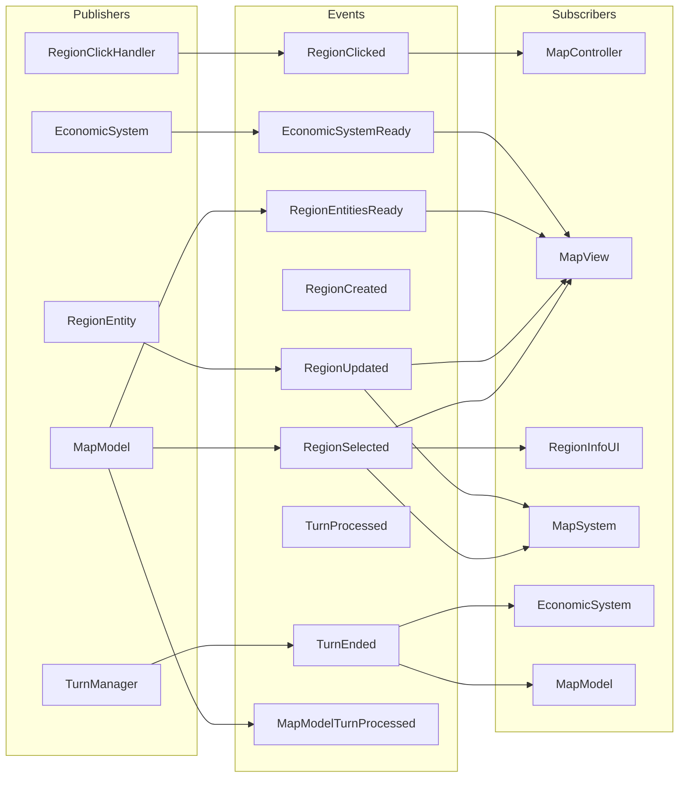
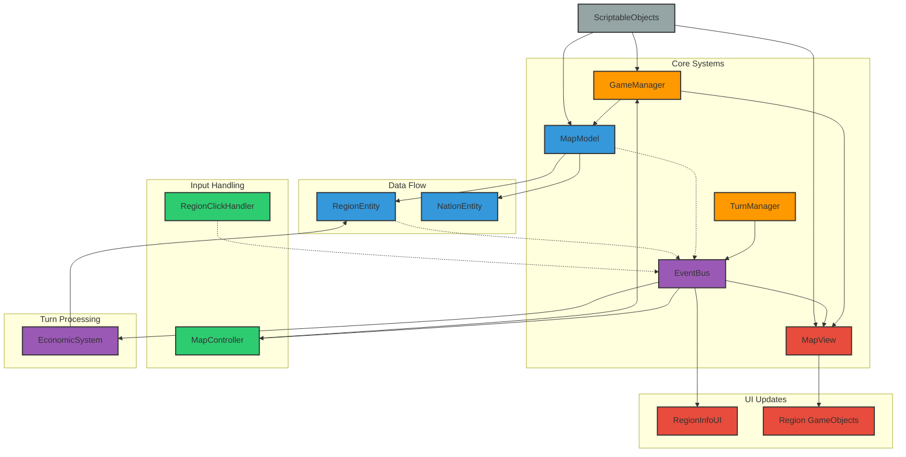
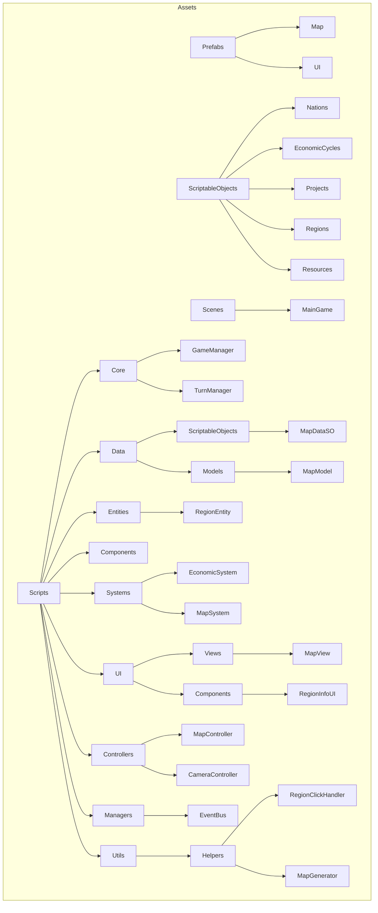

# Economic Cycles: Architecture Diagram

## Core Architecture

```mermaid
graph TD
    %% Core Managers
    subgraph "Core Managers"
        GM[GameManager]
        TM[TurnManager]
    end

    %% Data Layer
    subgraph "Data Layer"
        SO[ScriptableObjects]
        subgraph "Models"
            MM[MapModel]
            EM[EconomicModel]
        end
    end

    %% Entities
    subgraph "Entities"
        RE[RegionEntity]
        NE[NationEntity]
        PE[ProjectEntity]
    end

    %% Components
    subgraph "Components"
        RC[ResourceComponent]
        EC[EconomicComponent]
        VC[VisualComponent]
    end

    %% Systems
    subgraph "Systems"
        ES[EconomicSystem]
        MS[MapSystem]
        PS[ProjectSystem]
    end

    %% UI
    subgraph "User Interface"
        subgraph "Views"
            MV[MapView]
            RV[RegionView]
            EV[EconomicView]
        end
        subgraph "UI Components"
            RP[RegionPanel]
            RIU[RegionInfoUI]
            ED[EconomicDashboard]
        end
    end

    %% Controllers
    subgraph "Controllers"
        MC[MapController]
        CC[CameraController]
        PC[ProjectController]
    end

    %% Communication
    subgraph "Event Bus"
        EB[EventBus]
    end

    %% Utils
    subgraph "Utilities"
        MG[MapGenerator]
        RCH[RegionClickHandler]
        EF[EconomicFormulas]
    end

    %% Major Relationships
    GM --> MM
    GM --> TM
    MM --> RE
    MM --> NE
    MM -.-> EB
    RE --> RC
    RE --> EC
    
    MV --> SO
    MC -.-> EB
    MC --> GM
    
    MS -.-> EB
    MS --> MV
    
    ES -.-> EB
    ES --> RE
    
    TM -.-> EB
    
    RCH -.-> EB
    
    EB -.-> MS
    EB -.-> ES
    EB -.-> RIU
    EB -.-> MV
    
    RIU --> RE
    
    %% Legend
    classDef core fill:#ff9900,stroke:#333,stroke-width:2px
    classDef data fill:#3498db,stroke:#333,stroke-width:2px
    classDef entities fill:#2ecc71,stroke:#333,stroke-width:2px
    classDef components fill:#1abc9c,stroke:#333,stroke-width:2px
    classDef systems fill:#9b59b6,stroke:#333,stroke-width:2px
    classDef ui fill:#e74c3c,stroke:#333,stroke-width:2px
    classDef controllers fill:#f1c40f,stroke:#333,stroke-width:2px
    classDef events fill:#34495e,stroke:#333,stroke-width:2px
    classDef utils fill:#95a5a6,stroke:#333,stroke-width:2px
    
    class GM,TM core
    class SO,MM,EM data
    class RE,NE,PE entities
    class RC,EC,VC components
    class ES,MS,PS systems
    class MV,RV,EV,RP,RIU,ED ui
    class MC,CC,PC controllers
    class EB events
    class MG,RCH,EF utils
```

## Data Flow

## Event System

## Component Dependencies

## Folder Structure and Asset Organization

This architecture diagram provides a comprehensive overview of the Economic Cycles project structure, showing the relationships between different components and the data flow through the system. The event-based communication model is clearly illustrated, showing how different parts of the system interact without direct references.
